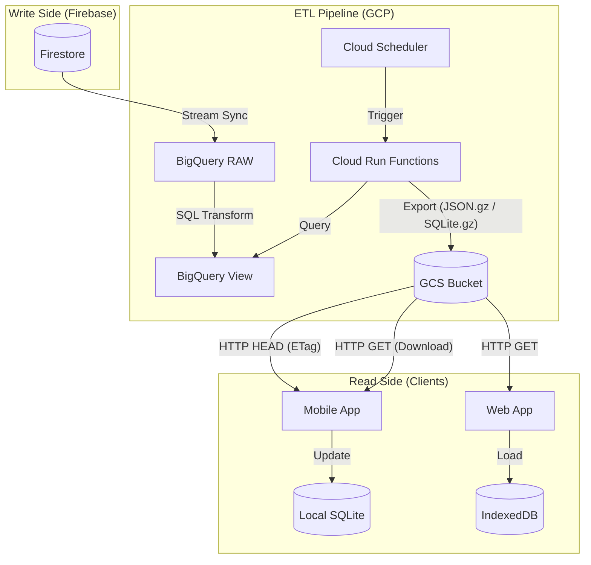

# 01 パイプライン（インフラ構成）設計書 - Issue 116

## 1. 概要
本設計書は、Firestoreのマスタデータを安価かつ高速にモバイルアプリ・Webへ配信するための、GCS Mirroring Architectureのインフラ全般を定義する。

## 2. 全体アーキテクチャ図 (Mermaid)

## 3. 各サービスの役割

| サービス | 役割 | 備考 |
| :--- | :--- | :--- |
| **Firestore** | 書き込みの正本 (Source of Truth) | マスタデータの追加・編集はここで行う。 |
| **BigQuery SDK (Extension)** | ニアリアルタイム同期 | `Stream Firestore to BigQuery` 拡張を使用。 |
| **BigQuery (ETL & Aggregation Engine)** | - 全てのデータ変更履歴から最新のスナップショットを生成。 - **[NEW] 統計・集計ロジックの集約** | 従来 Firestore バックグラウンドで行っていた平均透明度、レーダーチャート、マスタリー率、出現頻度等の集計を SQL (VIEW) で実行。これにより Firestore の Read/Write コマンドを大幅に削減。 |
| **Cloud Run Functions (Exporter)** | エクスポート実行エンジン | BigQueryからデータを引き、SQLiteファイルを生成してGCSへ保存。 |
| **GCS (Cloud Storage)** | 静的ファイル配信 | 高い可用性と低コストな配信を実現するCDNの源泉。 |
| **Cloud Scheduler** | 定期実行の管理 | パイプラインの起動（例: 1時間おき）を制御。 |

## 4. データ鮮度（レイテンシ）目標
- **Firestore → BigQuery**: 最短数秒（ニアリアルタイム）。
- **BigQuery → GCS**: 1時間（1回/時のエクスポート実行を想定）。
- **GCS → アプリ反映**: 次回アプリ起動時、または1日1回のバックグラウンド同期間隔。

## 5. 障害発生時のデータ到達性 (Fault Tolerance)

### 5.1 Cloud Functions が失敗した場合
- **挙動**: GCS上の古いマスタファイルが維持される。
- **影響**: 新しくポイントや生物が追加されても検索に出ないが、既存の検索機能は正常に動作し続ける（可用性優先）。
- **復旧**: 再試行ポリシーにより自動リトライ、または監視による手動再実行。

### 5.2 GCS との通信に失敗した場合
- **挙動**: アプリはローカルに保存済みの既存SQLite/IndexedDBデータを引き続き使用する。
- **影響**: オフライン環境と同様。最新データの取得はスキップされる。
- **ユーザー通知**: UIをブロックせず、サイレントに次回通信を待機。

### 5.3 ネットワーク帯域制限時 (Mobile)
- **対策**: `HEAD`リクエストによるETagチェックで、変更がない場合は本体（MB単位）をダウンロードしない。必ずgzip圧縮を行い、ペイロードを最小化する。
