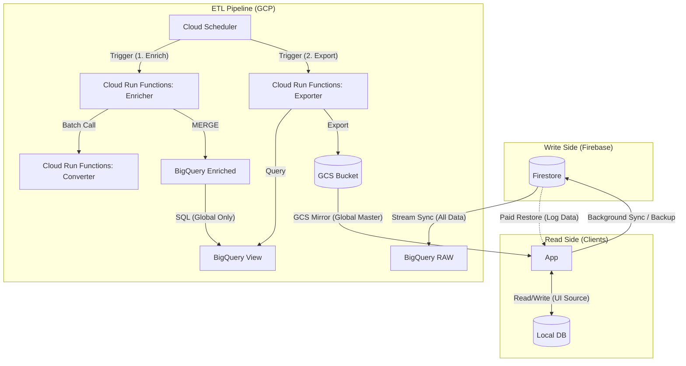

# 01 パイプライン（インフラ構成）設計書 - Issue 116

## 1. 概要
本設計書は、Firestoreのマスタデータを安価かつ高速にモバイルアプリ・Webへ配信するための、GCS Mirroring Architectureのインフラ全般を定義する。

## 2. 全体アーキテクチャ図 (Mermaid)

- **対象コレクション**: 
  - マスタ: `points`, `creatures`, `regions`, `zones`, `areas`, `shops`, `certifications`, `badges`
  - パブリック抽出: `reviews` (全件), `point_creature` (全件), `logs` (isPrivate=false のみ)

## 3. 各サービスの役割

| サービス | 役割 | 備考 |
| :--- | :--- | :--- |
| **Firestore** | 1. 書き込みの正本 (Source of Truth) 2. **個人データの同期・バックアップ** | マスタデータの追加・編集に加え、個人のログ（非同期バックアップ）、お気に入り、マスタリー統計などを保持。 ※ログ/お気に入りなどマスタリ以外の下り同期（リストア）はコスト抑制のため有料オプション。 |
| **BigQuery (ETL & Aggregation Engine)** | - 公共スナップショットの生成 - **[NEW] 増分エンリッチメント**: カナ変換等の重い処理を差分のみ実行し、永続テーブルに保持。 - **公共統計・集計ロジックの集約** | 共通マスタおよび、レビュー等から算出される公共統計を担当。コスト最適化のため、毎回のリモート関数呼び出しを避ける設計。 |
| **Cloud Run Functions** | **1. Enricher**: 差分変換 & 永続化 **2. Converter**: カナ変換エンジン(API) **3. Exporter**: GCS配信用ファイル生成 | 各機能を独立させることで、保守性とコスト効率を最大化。 |
| **GCS (Cloud Storage)** | 静的ファイル配信 (Global Master) | 全ユーザー共通のデータを低コスト・高速に配信。**個人情報は一切含まない**。 |
| **Cloud Scheduler** | 定期実行の管理 | パイプラインの起動（例: 1時間おき）を制御。 |

## 4. データ鮮度（レイテンシ）目標
- **Firestore → BigQuery**: 最短数秒（ニアリアルタイム）。
- **BigQuery → GCS**: 1時間（1回/時のエクスポート実行を想定）。
- **GCS → アプリ反映**: 次回アプリ起動時、または1日1回のバックグラウンド同期間隔。

## 5. 障害発生時のデータ到達性 (Fault Tolerance)

### 5.1 Cloud Functions が失敗した場合
- **挙動**: GCS上の古いマスタファイルが維持される。
- **影響**: 新しくポイントや生物が追加されても検索に出ないが、既存の検索機能は正常に動作し続ける（可用性優先）。
- **復旧**: 再試行ポリシーにより自動リトライ、または監視による手動再実行。

### 5.2 GCS との通信に失敗した場合
- **挙動**: アプリはローカルに保存済みの既存SQLite/IndexedDBデータを引き続き使用する。
- **影響**: オフライン環境と同様。最新データの取得はスキップされる。
- **ユーザー通知**: UIをブロックせず、サイレントに次回通信を待機。

### 5.3 ネットワーク帯域制限時 (Mobile)
- **対策**: `HEAD`リクエストによるETagチェックで、変更がない場合は本体（MB単位）をダウンロードしない。必ずgzip圧縮を行い、ペイロードを最小化する。
