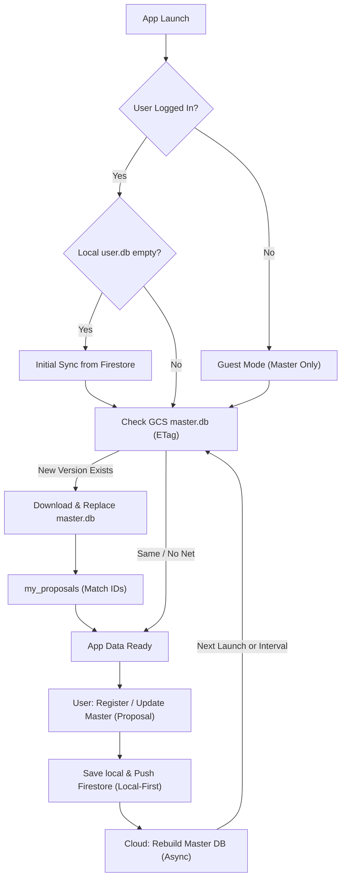
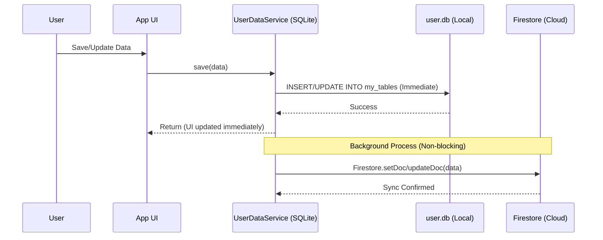
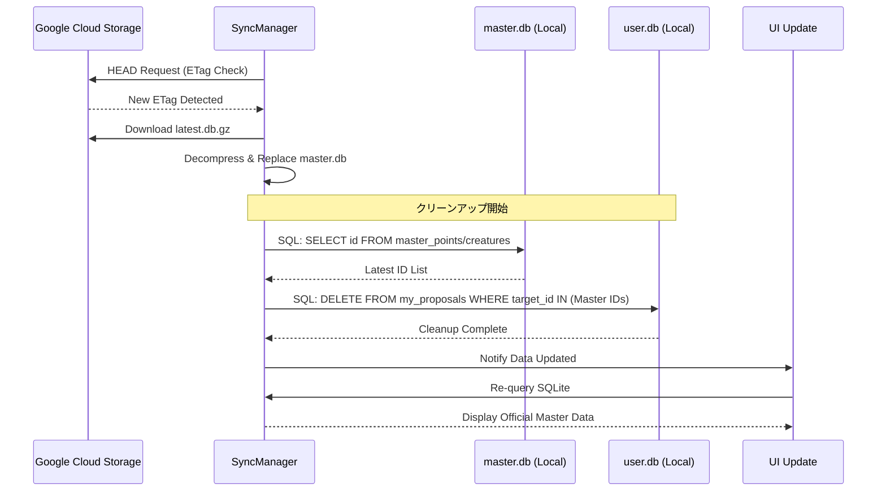

# 05 同期・検索基盤の実装 (Issue 116)

## 1. 概要
・アプリがGCSからデータを受け取り、高速検索を行う基盤を実装します。

## 2.1 SQLite & Gzip インフラ整備
### 作業内容: 
expo-sqlite および gzip解凍ライブラリの導入。
### 詳細:
アプリ内のローカルDB保存領域の確保。
`gzip`を扱うユーティリティクラスの作成。

## 2.2 同期マネージャー（SyncManager）実装
### 作業内容: 
ETagベースの同期ロジック実装。
### 詳細:
HEAD リクエストでGCSのETagを確認。
変更がある場合のみダウンロード → 解凍 → SQLiteへ保存。
通信失敗時のリトライ・フォールバック（旧データの維持）処理。

## 2.3 データアクセス層（DAL）のリファクタリング
### 作業内容: 
フックのデータソース切り替え。
### 詳細:
`usePoints, useCreatures` 等の内部処理を「Firestore直接参照」から「SQLiteクエリ」へ変更。
インデックス（CREATE INDEX）を貼り、前方一致・部分一致検索を最適化。

---

## 3. シーケンス・フロー図

### 3.1 同期およびデータライフサイクル・フロー
アプリ起動からデータの準備、ユーザーによる更新、そしてマスタ反映による自浄作用までを一本の線で定義します。

---

## 3.2 シーケンス図の解説
データの整合性とユーザー体験を両立するため、以下の 2 つの時間軸での動きを定義しています。

1.  **保存シーケンス (即時性)**: ユーザーが操作した瞬間に「まずローカルを更新し、裏でサーバーに送る」動き。これにより圏外でも操作が完了します。
2.  **クリーンアップシーケンス (整合性)**: サーバーで処理（承認）されたデータが「数時間後に公式マスタとして降ってきた」時に、重複するローカルデータを掃除する動き。これにより、公式データへのスムーズな移行を実現します。

### 3.3 ユーザーデータ保存シーケンス (Universal Local-First)
ログ、レビュー、設定、プロポーザルなど、ユーザーが書き込みを行うすべてのデータ（`my_` テーブル群）に共通する同期フローです。

### 3.4 マスタ反映による Proposal クリーンアップ・シーケンス

---

# 4. 作業進捗 (Issue 116)

## Phase2作業内容レビュー
- 【A】 基盤構築：同期・管理レイヤー
  - [x] GCSダウンロード機能の実装: 
    - v1/master/latest.db.gz を取得するユーティリティ。
  - [x] バージョン管理・インクリメンタル更新ロジック:
    - アプリ起動時（またはバックグラウンド）に GCS の latest.db.gz のメタデータ（ETag/Last-Modified）を確認。
    - 差分があればダウンロードし、無ければローカルを維持する仕組み。
  - [ ] 個人データ初期同期ロジック (Firestore Initial Sync) 
    - アプリ起動/ログイン時、個人用SQLite(user.db)が空の場合のみ、Firestoreからそのユーザーの全データを取得し保存。
  - [x] ストレージ・マルチDB管理
    - master.db（GCS配信の読み取り専用）と user.db（ユーザーの書き込み・同期用）の使い分け。
  - [x] 解凍・ストレージ配置: 
    - latest.db.gz を解凍（gzip）し、expo-sqlite が読み込めるディレクトリ（SQLite/）に配置する処理。
- 【B】 検索・データ操作レイヤー（SQLエンジン）
  - [x] MasterDataService の作成: 
    - expo-sqlite をラップし、BigQuery 由来の各テーブル（master_points, master_creatures 等）へのクエリ機能を提供。
  - [x] 爆速かな検索」クエリの実装: 
    - name_kana や search_text カラムを利用した、インクリメンタル検索用 SQL（LIKE検索）の作成。
  - [x] UserDataService (または LogService) の SQLite 化
    - ログ、プロフィール、お気に入りの操作を 「SQLiteへ即時書き込み ＋ Firestoreへ非同期Push」 するロジックへの改修。
- 【C】 UI・機能統合レイヤー
  - [ ] 既存の検索コンポーネントの差し替え:
    - [x] 今まで Firestore に Request を送っていた部分を、MasterDataService.search() に切り替え。
    - [ ] ログ一覧やプロフィール表示もローカルSQLite（user.db）を正本として表示するように変更。
  - [x] スポット詳細・生物詳細のデータ取得先変更:
    - リスト表示から詳細へ遷移する際、SQLite 側のリッチなデータ（name_kana や統計データ）を優先的に表示。

- 【D】 ログ管理・ヘルスチェック（検証用）
  - [x] 同期失敗時のフォールバック機能: 
    - SQLite が何らかの理由で壊れたり落とせなかった場合、Firestore 検索へフォールバックする仕組み。
  - [x] ストレージ管理: 
    - 古いバージョンの DB ファイルの自動削除。

## 設計レビュー
  - [x] シーケンス図
  - [x] フロー図
