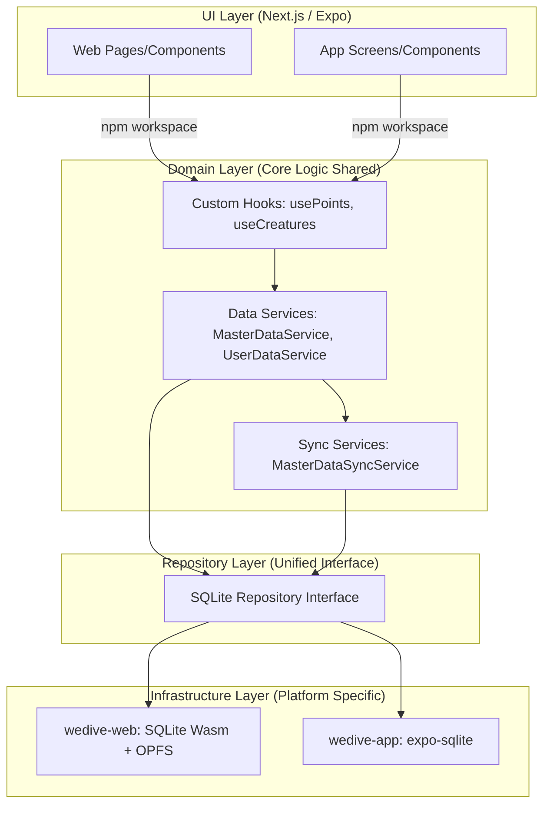
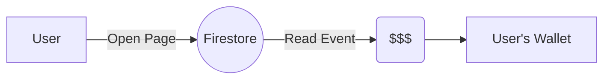
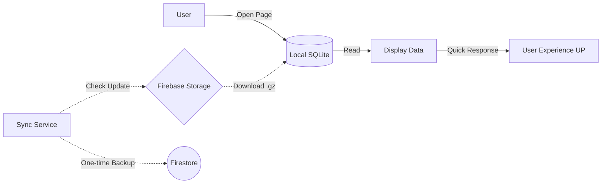
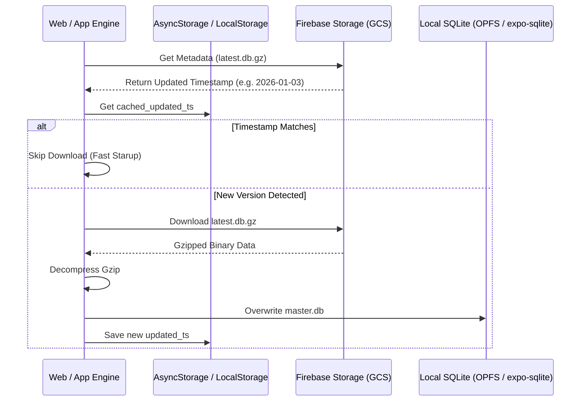
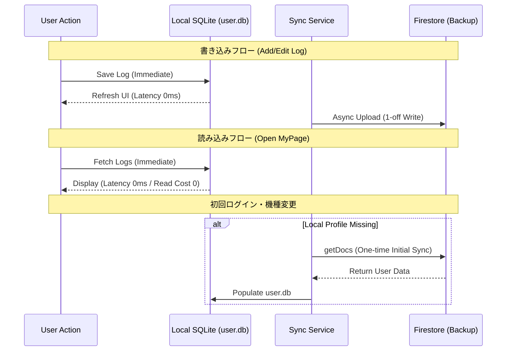

# design: Web版 Local-First アーキテクチャとエンジン共通化設計

Issue 116 の Phase 3 として、Web版（Next.js）への Local-First 導入および、App版（Expo）とのロジック共通化に関する詳細設計を定義します。

---

## 1. 概念図：レイヤー構造とロジック共通化

Web と App でリポジトリ、共通のロジック層を共有し、最下層の「ストレージ実装」のみをプラットフォームごとに差し替えるアーキテクチャを採用します。



### 参照する主要クラス・概念
- **wedive-shared (New Package)**: ドメインロジック (Service) とインターフェース (Repository) を保持する npm ローカルパッケージ。
- **DataService**: アプリケーションロジックの中核。SQLite と Firestore の優先順位（Local-First 戦略）を管理。
- **SQLite_Repo**: SQL クエリの発行を担うインターフェース。Web/App ともに全く同じ SQL クエリを利用。

---

## 2. モノレポ（npm workspaces）構成

ロジックの共有を確実かつクリーンに行うため、以下のディレクトリ構造を採用します。

```text
/Users/minarai/pgm/wedive/
├── package.json            (npm workspaces 有効化)
├── wedive-shared/          <-- 【新設】共通パッケージ
│   ├── src/
│   │   ├── index.ts        (エントリポイント)
│   │   ├── types/          (共通の型定義: Region, Point, Log 等を一本化)
│   │   ├── repository/     (SQLiteExecutor: プラットフォーム抽象化)
│   │   └── services/       (BaseMasterDataService: 共通検索ロジック)
│   └── dist/               (ビルド済み成果物)
├── wedive-app/             (wedive-shared を利用)
└── wedive-web/             (wedive-shared を利用)
```

### 共通化のメリット
- **Single Source of Truth**: `search_text` を使った複雑な SQL クエリや、Firestore との同期ロジックを一箇所で修正すれば、即座に両プラットフォームへ反映されます。
- **型の一貫性**: `Point` や `Creature` などの型定義が Web/App で乖離するのを防ぎます。

---

## 2. データフロー比較：従来 vs Local-First (Phase 3)

### 従来（Legacy-First）
ユーザーが画面を開くたびに Firestore への課金が発生し、通信環境に依存する。


### Local-First (Phase 3)
一度同期すれば、以降の読み出しはすべて「ローカル 0 円」で完済する。


---

## 3. シーケンス図

### 3.1 マスターデータ同期フロー (Web/App 共通)
Firebase Storage のメタデータを活用し、無駄なダウンロードを徹底的に防ぎます。



### 3.2 ユーザーデータ（個人ログ）の同期フロー
Firestore の `onSnapshot` を廃止し、明示的な書き込みと初回同期のみに絞ります。



---

## 4. Web vs App の実装差異

共通の `DataService` を支える「ストレージ実装」のみを切り替えます。

| 項目 | Web版 (Phase 3) | App版 (Implemented) |
| :--- | :--- | :--- |
| **Engine** | SQLite Wasm (wa-sqlite) | expo-sqlite |
| **Persistence** | OPFS (Origin Private File System) | Local Filesystems (DocumentDir) |
| **Binary Fetch** | Fetch API + Stream | expo-file-system |
| **Concurrency** | Web Worker (Background) | Native Bridge |
| **Initial Bundle** | Static Asset (optional) | assets/master.db (Bundled) |

---

## 5. ロジック共通化のロードマップ

npm workspaces を活用し、以下のステップでモノレポ環境を構築します。

1.  **Stage 1: Root Workspaces の構築**
    - ルートディレクトリに `package.json` を作成し、`workspaces: ["wedive-*"]` を定義。
    - `wedive-shared` ディレクトリを新設し、共通の `package.json`（name: "wedive-shared"）を配置。
2.  **Stage 2: 型定義と定数の移行**
    - `wedive-app` と `wedive-web` で重複している `types.ts` を `wedive-shared/src/types` へ集約。
    - 両プロジェクトの `package.json` で `"wedive-shared": "*"` を dependency に追加。
3.  **Stage 3: サービス/リポジトリ層の抽出**
    - 今回プロトタイプで作成した `MasterDataService` や `UserDataService` を `wedive-shared` へ移動。
    - プラットフォーム固有の処理（SQLite のオープン等）を `SQLite_Repo` インターフェースで抽象化し、実行時に依存性注入 (DI) する仕組みを完成。

---
**設計のハイライト**:
- **共通化の恩恵**: 検索ロジック（`search_text` ヒット順など）を修正した際、Web と App 両方に一撃で反映されるようになります。
- **コストの徹底排除**: 常時接続を辞め、マスタも個人ログも「必要な時だけ引っ張る」ストロング・オフライン・スタイルを Web でも実現します。
- **爆速化**: OPFS + SQLite Wasm により、数千件のログの集計や検索が、サーバーへの往復なしにミリ秒単位で完了します。


## ビルドエラー時の対応

```
# エラーが出ている Tailwind の Linux 用バイナリを直接叩き込む
npm install @tailwindcss/oxide-linux-x64-gnu --save-optional

# 前回の lightningcss のエラーも念のため同様に処理
npm install lightningcss-linux-x64-gnu --save-optional
```

## 6. Web版 OPFS 実装における重要な注意点 (COOP/COEP)

OPFS (Origin Private File System) と `SharedArrayBuffer` を利用して高速な SQLite パフォーマンスを実現するためには、厳しいセキュリティヘッダーの設定が不可欠です。
特に、**メインの HTML ファイルだけでなく、実際に処理を行う Worker や Proxy JS ファイルに対してもヘッダーを適用する必要がある** 点が最大のハマりポイントです。

### 必須ヘッダー構成
```json
"headers": [
  {
    "key": "Cross-Origin-Embedder-Policy",
    "value": "require-corp"
  },
  {
    "key": "Cross-Origin-Opener-Policy",
    "value": "same-origin"
  }
]
```

### 解決策と配置のルール
1. **HTML だけでなく JS にも適用**:
    - Vite のバンドルによって JS ファイルが生成されますが、`sqlite3-opfs-async-proxy.js` のような動的に読み込まれる Worker ファイルにも `Cross-Origin-Resource-Policy: same-origin` などの設定が必要です。

2. **物理ファイルの配置 (重要)**:
    - Vite は `src` 内のファイルをバンドルしてハッシュ化しますが、`locateFile` をオーバーライドして明示的にファイルを読み込む場合、**`public/` ディレクトリ配下に物理的にファイルを配置** しないと、Firebase Hosting の `headers` ルール（globパターン）が正しく適用されない（またはファイルが見つからない）ケースがあります。
    - 解決策：`sqlite3-opfs-async-proxy.js` を `public/assets/` に物理コピーし、コード側でそのパスを明示的に指定することで、確実にレスポンスヘッダーを制御できます。

### Google Maps などの外部 iframe への影響
- この `require-corp` 設定を有効にすると、CORP ヘッダーを持たない外部リソース（Google Maps iframe, YouTube embed など）が読み込めなくなる副作用があります。
- これらを併用する場合は、`Cross-Origin-Embedder-Policy: credentialless` (Chrome 96+) の利用を検討するか、Local-First 戦略と外部埋め込みのトレードオフを再考する必要があります。
