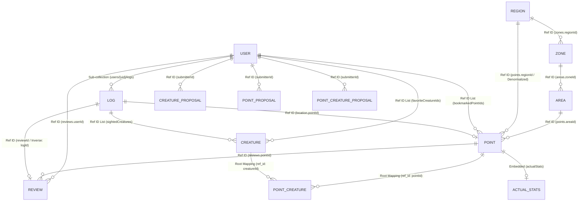
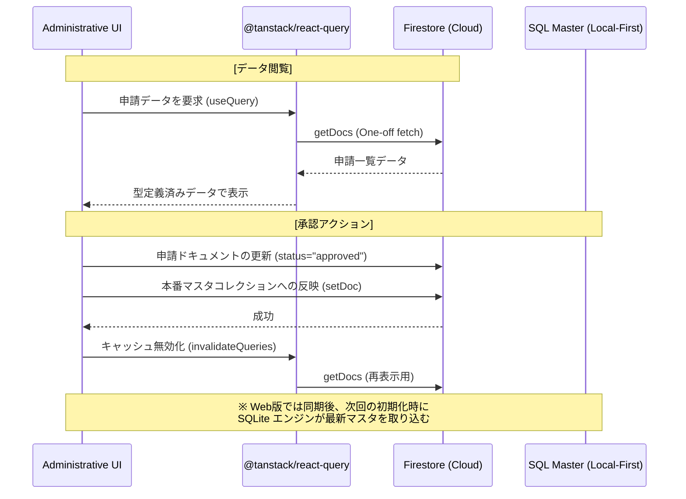

# WeDive データベース設計仕様書

本ドキュメントは、WeDive アプリケーションで使用される Firestore データベースの技術仕様、命名規則、およびデータ構造を「正確かつ完全」に定義します。

---

## 1. ID 命名規則 (ID Policy)

一貫性を維持し、AI やバッチ処理による誤操作（ハルシネーション）を防ぐため、以下の規則を厳守します。

### 1.1 マスタデータ
`points`, `creatures`, `areas`, `zones`, `regions` コレクション。
- **形式**: `[プレフィックス][数字のみ]` (例: `p1766033814156`)
- **禁止事項**: **アンダースコア (`_`) は一切含めない。**
- **プレフィックス**: `p` (Point), `c` (Creature), `a` (Area), `z` (Zone), `r` (Region), `rv` (Review), `l` (Log), `propp` (PointProposal), `propc` (CreatureProposal), `proppc` (PointCreatureProposal)

### 1.2 マッピングデータ
`point_creatures` コレクション。
- **形式**: `[PointID]_[CreatureID]` (例: `p123_c456`)
- **ルール**: 区切り文字として **アンダースコアを1つだけ** 使用する。

---

## 2. コレクション・SQLite テーブル対応一覧

| Firestore コレクション | FS カラム数 | Master SQLite Table | Master カラム数 | Personal SQLite Table (my_) | Personal カラム数 |
| :--- | :---: | :--- | :---: | :--- | :---: |
| `regions` / `zones` / `areas` | 3 / 4 / 5 | `master_geography` | 13 | － | － |
| `points` | 28 | `master_points` | 34 | `my_bookmarks` / `my_mastery` | 2 / 5 |
| `creatures` | 23 | `master_creatures` | 25 | `my_favorites` | 2 |
| `point_creatures` | 8 | `master_point_creatures` | 10 | － | － |
| `reviews` | 19 | `master_point_reviews` | 21 | `my_reviews` | 12 |
| `users` | 16 | － | － | `my_settings` | 2 |
| `users/{uid}/aiConciergeTickets` | 9 | － | － | `my_ai_concierge_tickets` | 8 |
| `users/{uid}/logs` | 21 | `master_public_logs` | 24 | `my_logs` | 24 |
| `certifications` | 4 | `master_certifications` | 4 | － | － |
| `badges` | 4 | `master_badges` | 4 | － | － |
| `*_proposals` | 8 | － | － | `my_proposals` | 6 |

### **カラム数に差異がある主な理由 (Rationale)**

Firestore のドキュメント構造と SQLite のテーブル定義でカラム数が異なるのは、モバイルアプリでの「オフライン性能」と「検索速度」を最大化するための意図的な設計によるものです。

1. **ネスト構造のフラット化 (Flattening)**:
   - Firestore では `map` 型（例: `coordinates`, `depth`）で保持しているデータを、SQLite では個別の物理カラム（例: `latitude`, `longitude`, `depth_max`）として分解しています。これにより、SQL の `WHERE` 句や `ORDER BY` でのインデックス利用が可能になります。
2. **高速検索用のインデックス追加 (Pellucid Search)**:
   - マスタデータには、BigQuery 側で事前計算した `search_text`（和名・学名・英名・地域名を結合したもの）や `name_kana` カラムを追加しています。これにより、アプリ側で重い文字列結合処理を行わずに高速な部分一致検索を実現しています。
3. **結合排除のための非正規化 (Denormalization)**:
   - SQLite でのテーブル結合（JOIN）はコストが高いため、あらかじめ参照先の名称（例: `point_name`, `region_name`）をカラムとして重複保持しています。
4. **将来の互換性とフォールバック (Compatibility)**:
   - `my_logs` 等の個人データには `data_json` カラムを設けており、Firestore の生ドキュメントをそのまま保持しています。これにより、アプリのバージョンアップで新しいフィールドが追加された際も、マイグレーションなしでデータを保持・復元できます。
5. **管理用メタデータの付与 (Management)**:
   - 同期状態を管理するための `synced_at` や、ローカルでのソート順を保証するための `created_at`（Firestore の `serverTimestamp` とは別の、アプリ保存時のタイムスタンプ）を追加しています。

---

## 3. エンティティ関連図 (Database Structure)

### 関連用語の凡例 (Legend)
- **Sub-collection**: Firestore の物理的な階層構造。親のパス (`/users/uid`) の下に配置される。
- **Ref ID**: 他ドキュメントの ID を単一の `string` フィールドとして保持。
- **Ref ID List**: 他ドキュメントの ID を `string[]` (配列) 形式で保持。
- **Root Mapping**: 多対多を実現するため、Root に配置した中間テーブル的役割のコレクション。
- **Embedded**: 正規化せず、ドキュメント内に直接持っている属性情報（Map/独自オブジェクト）。
- **Denormalized**: 結合（Join）を避けるため、正規化を崩して重複して持たせているデータ。

---

## 4. コレクション・スキーマ詳細

### 4.1 `regions`, `zones`, `areas` (場所マスタ階層)
| フィールド | 型 | 説明 |
| :--- | :--- | :--- |
| `id` | string | `r` / `z` / `a` + 文字列（アンダースコアなし） |
| `name` | string | 名称 |
| `description` | string | (Option) 説明文 |
| `regionId` | string | (Zone, Areaのみ) 所属RegionのID |
| `zoneId` | string | (Areaのみ) 所属ZoneのID |

### 4.2 `points` (ダイビングポイント)
| フィールド | 型 | 説明 |
| :--- | :--- | :--- |
| `id` | string | `p` + 文字列（アンダースコアなし） |
| `name` | string | ポイント名 |
| `areaId` | string | 親AreaのID |
| `zoneId` | string | 親ZoneのID |
| `regionId` | string | 親RegionのID |
| `region` | string | 地域名 (冗長化) |
| `zone` | string | ゾーン名 (冗長化) |
| `area` | string | エリア名 (冗長化) |
| `level` | string | Beginner, Intermediate, Advanced |
| `maxDepth` | number | 最大水深 (m) |
| `mainDepth` | map | 推奨・みどころ水深域: `{min, max}` |
| `entryType` | string | beach, boat, entry_easy |
| `current` | string | none, weak, strong, drift |
| `topography` | array(string) | 地形タグ (sand, rock, wall, cave, muck) |
| `description` | string | 詳細説明 |
| `features` | array(string) | 特徴タグ |
| `coordinates` | map | `{lat: number, lng: number}` |
| `googlePlaceId`| string | Google Maps Place ID |
| `formattedAddress`|string| Google Maps 住所 |
| `status` | string | approved（マスタは常に承認済みのみ） |
| `submitterId` | string | 登録者UID |
| `createdAt` | string | 作成日時 (ISO8601) |
| `images` | array(string) | 画像URLリスト |
| `imageUrl` | string | メイン画像URL |
| `imageKeyword` | string | 画像検索用キーワード |
| `bookmarkCount` | number | ブックマーク数 |
| `officialStats`| map | `{visibility: [min, max], currents: string[], difficulty: string, radar: {encounter, excite, macro, comfort, visibility}}` |
| `actualStats` | map | 集計データ: `{avgRating, avgVisibility, currentCondition: {weather, wave}, seasonalRadar: {month: radar}}` |

### 4.3 `creatures` (生物マスタ)
| フィールド | 型 | 説明 |
| :--- | :--- | :--- |
| `id` | string | `c` + 文字列（アンダースコアなし） |
| `name` | string | 和名 |
| `scientificName`| string | 学名 |
| `englishName` | string | 英名 |
| `family` | string | 科目 |
| `category` | string | カテゴリ (魚類, 甲殻類, etc.) |
| `description` | string | 説明文 |
| `rarity` | string | グローバル・レア度 (Common, Rare, Epic, Legendary) |
| `imageUrl` | string | メイン画像URL |
| `tags` | array(string) | タグリスト |
| `depthRange` | map | `{min: number, max: number}` |
| `specialAttributes`| array(string) | 毒, 擬態, 夜行性 などの属性 |
| `waterTempRange`| map | `{min: number, max: number}` |
| `status` | string | approved（マスタは常に承認済みのみ） |
| `size` | string | サイズ感 |
| `season` | array(string) | 見られる季節 |
| `submitterId` | string | 登録者UID |
| `gallery` | array(string) | 追加画像URLリスト |
| `stats` | map | `{popularity, size, danger, lifespan, rarity, speed}` (1-5の数値) |
| `imageCredit` | string | 画像の著作権情報 |
| `imageLicense` | string | ライセンス情報 |
| `imageKeyword` | string | 画像検索用キーワード |

### 4.4 `point_creatures` (地点別出現生物)
| フィールド | 型 | 説明 |
| :--- | :--- | :--- |
| `id` | string | `[pointId]_[creatureId]` |
| `pointId` | string | ポイントID |
| `creatureId` | string | 生物ID |
| `localRarity` | string | その地点固有のレア度 (Common, Rare, Epic, Legendary) |
| `lastSighted` | string | 最終目撃日 (Option) |
| `status` | string | approved または 論理削除の rejected |
| `reasoning` | string | AIによる紐付け根拠 |
| `confidence` | number | AI確信度 (0.0-1.0) |

### 4.5 `users` (ユーザープロファイル)
| フィールド | 型 | 説明 |
| :--- | :--- | :--- |
| `id` | string | Firebase Auth UID |
| `name` | string | 表示名 |
| `role` | string | user, moderator, admin |
| `trustScore` | number | トラストスコア |
| `profileImage` | string | プロフィール画像URL |
| `favorites` | map | ポイント、エリア、ショップ、器材のお気に入り |
| `favoriteCreatureIds`| array(string) | お気に入り生物IDリスト |
| `wanted` | array(string) | 会いたい生物IDリスト |
| `bookmarkedPointIds` | array(string) | ブックマーク地点IDリスト |
| `certification` | map | `{orgId, rankId, date}` |
| `badges` | array(map) | `{badgeId, earnedAt}` |
| `subscription` | map | `{status: active/inactive}` |
| `aiConciergeTickets` | map | `{totalAvailable, lastDailyGrant, periodContribution: {points, creatures, reviews}}` (UIサマリー用) |
| `agreedAt` | string | 利用規約同意日時 |
| `agreedTermsVersion`| string | 同意した規約バージョン |
| `createdAt` | string | アカウント作成日 |
| `status` | string | provisional, active, suspended, withdrawn |

### 4.6 `users/{uid}/aiConciergeTickets` (AIコンシェルジュ・チケット - サブコレクション)
AIコンシェルジュ（チャット）の利用権を管理します。一回使い切りのチケット形式で、有効期限を持ちます。
| フィールド | 型 | 説明 |
| :--- | :--- | :--- |
| `id` | string | ドキュメントID |
| `type` | string | `daily` (ログイン), `contribution` (貢献), `bonus` (特別), `purchased` (購入) |
| `count` | number | 付与されたチケット数 |
| `remainingCount`| number | 残りのチケット数 |
| `grantedAt` | string | 付与日時 (ISO8601) |
| `expiresAt` | string | 有効期限 (ISO8601 / 使用期限なしの場合は null) |
| `status` | string | `active`, `used`, `expired` |
| `reason` | string | 付与理由（例: "伊豆海洋公園 ポイント登録承認"） |
| `metadata` | map | キャンペーンID等の追加情報 |

### 4.7 `users/{uid}/logs` (ダイビングログ - サブコレクション)
WeDive では、スケーラビリティとクエリ効率を考慮し、ユーザーのダイビングログをルートの `logs` コレクションではなく、各ユーザーの **サブコレクション** として配置します。
| フィールド | 型 | 説明 |
| :--- | :--- | :--- |
| `id` | string | `l` + タイムスタンプ |
| `userId` | string | 所有者UID |
| `date` | string | 潜水日 (ISO8601) |
| `diveNumber` | number | 潜水本数 |
| `location` | map | `{pointId, pointName, region, shopName, lat, lng}` |
| `team` | map | `{buddy, guide, members}` |
| `time` | map | `{entry, exit, duration, surfaceInterval}` |
| `depth` | map | `{max, average}` |
| `condition` | map | `{weather, airTemp, waterTemp, transparency, wave, current, surge, waterType}` |
| `gear` | map | `{suitType, suitThickness, weight, tank}` |
| `entryType` | string | beach, boat |
| `creatureId` | string | メイン生物のID (Option) |
| `sightedCreatures` | array(string) | 目撃した生物IDのリスト |
| `photos` | array(string) | 写真URLリスト |
| `comment` | string | ログコメント |
| `isPrivate` | boolean | 非公開フラグ |
| `likeCount` | number | いいね数 |
| `likedBy` | array(string) | いいねしたユーザーUIDリスト |
| `garminActivityId` | string | Garmin連携ID (重複防止) |
| `reviewId` | string | 関連レビューID (双方向リンク用) |
| `profile` | array(map) | `{depth, temp, hr, time}` ダイブプロファイルデータ |

### 4.8 `reviews` (ポイントレビュー)
ポイントに対するユーザーの生の声と環境実測値を管理します。
| フィールド | 型 | 説明 |
| :--- | :--- | :--- |
| `id` | string | `rv` + タイムスタンプ |
| `pointId` | string | 対象ポイントID |
| `areaId`, `zoneId`, `regionId` | string | (Denormalized) 階層ID (集計用) |
| `userId` | string | 投稿者ID |
| `logId` | string | 関連ログID (任意) |
| `rating` | number | 総合満足度 (1-5) |
| `condition` | map | `{weather, wind, wave, airTemp, waterTemp}` |
| `metrics` | map | `{depthAvg, depthMax, visibility, flow, difficulty, macroWideRatio}` |
| `radar` | map | `{encounter, excite, macro, comfort, visibility}` (1-5スコア) |
| `tags` | array(string)| 遭遇生物、地形、見どころタグ |
| `comment` | string | 感想コメント |
| `images` | array(string)| 写真URLリスト |
| `status` | string | pending, approved, rejected |
| `trustLevel` | string | standard, verified, expert, professional, official |
| `helpfulCount`| number | 「参考になった」の数 |
| `helpfulBy` | array(string)| ユーザーIDリスト |
| `createdAt` | string | 投稿日時 |

### 4.9 `ai_grounding_cache` (AI事実確認キャッシュ)
AIによる再構築結果や検索結果を保存し、費用の抑制と高速化を図る。
| フィールド | 型 | 説明 |
| :--- | :--- | :--- |
| `id` | string | クエリハッシュ等 |
| `query` | string | 検索クエリ |
| `result` | map | 検索結果データ |
| `expiresAt` | string | 有効期限 |

### 4.10 `*_proposals` (マスタ申請データ群)
`creature_proposals`, `point_proposals` など。
| フィールド | 型 | 説明 |
| :--- | :--- | :--- |
| `id` | string | `propc` / `propp` + タイムスタンプ |
| `targetId` | string | 対象マスタID |
| `proposalType` | string | create, update, delete |
| `diffData` | map | (Update時) 変更後のフィールド差分 |
| `submitterId` | string | 申請者UID |
| `status` | string | pending, approved, rejected |
| `createdAt`, `processedAt` | string | 申請日時 / 承認・却下日時 |

### 4.11 `point_creature_proposals` (ポイント-生物紐付け申請)
| フィールド | 型 | 説明 |
| :--- | :--- | :--- |
| `id` | string | `proppc` + タイムスタンプ |
| `pointId`, `creatureId` | string | 対象ID |
| `localRarity` | string | 提案するレア度 |
| `proposalType` | string | create, delete |
| `targetId` | string | 予約ID `pointId_creatureId` |
| `submitterId` | string | 申請者UID |
| `status` | string | pending, approved, rejected |
| `createdAt`, `processedAt` | string | 申請日時 / 承認・却下日時 |
| `reasoning` | string | (Option) 申請理由・根拠 |

### 4.12 `certifications` (認定資格マスタ)
| フィールド | 型 | 説明 |
| :--- | :--- | :--- |
| `id` | string | `cert` + 文字列 |
| `name` | string | 資格名 (例: Open Water Diver) |
| `organization` | string | 団体名 (PADI, NAUI, etc.) |
| `ranks` | array(map) | `{rankId, name}` ランク情報のリスト |

### 4.13 `badges` (バッジマスタ)
| フィールド | 型 | 説明 |
| :--- | :--- | :--- |
| `id` | string | `bdg` + 文字列 |
| `name` | string | バッジ名称 |
| `iconUrl` | string | アイコン画像URL |
| `condition` | map | 獲得条件定義 |

### 4.14 管理画面におけるデータフロー（審査・承認プロセス）

管理画面（Admin/Moderator）におけるデータの取得と更新は、以下の原則に従う。

1.  **一回限りの取得 (One-off Fetch)**:
    *   Firestore 側の `onSnapshot`（常時監視）は**全廃**している。コスト削減と無限ループ防止のため、リアルタイムリスナーは一切使用しない。
    *   `@tanstack/react-query` の `useQuery` を利用し、画面初期表示時またはユーザー操作時に `getDocs` を実行する。

2.  **型安全性の担保**:
    *   Firestore から取得したデータは、各コレクションに対応する TypeScript インターフェース（`CreatureProposal`, `PointProposal` 等）へキャストして処理する。
    *   `implicit any` を排除し、管理 UI の堅牢性を確保する。

3.  **更新と整合性**:
    *   承認/却下アクションを実行した後は、Firestore のドキュメントを直接更新（`updateDoc` / `setDoc`）する。
    *   更新成功後、`queryClient.invalidateQueries` を呼び出し、React Query のキャッシュを無効化する。
    *   自動的に最新のデータを再取得（Refetch）することで、UI 上のステータスを同期する。

**データフロー図 (Mermaid)**:

---

## 5. SQLite テーブル定義 (Mobile Local)

### 5.1 Personal Data (`user.db`)

#### `my_ai_chat_tickets`
| フィールド | 型 | 説明 |
| :--- | :--- | :--- |
| `id` | TEXT PRIMARY KEY | ドキュメントID |
| `type` | TEXT | `daily`, `contribution`, `bonus`, `purchased` |
| `remaining_count`| INTEGER | 残りのチケット数 |
| `granted_at` | TEXT | 付与日時 (ISO8601) |
| `expires_at` | TEXT | 有効期限 (ISO8601) |
| `status` | TEXT | `active`, `used`, `expired` |
| `reason` | TEXT | 付与理由 |
| `synced_at` | TEXT | Firestoreとの最終同期日時 |

---

## 6. インデックス設計 (Index Design)

Firestore のクエリ性能を最適化し、複雑な絞り込み・並べ替えを実現するために以下の複合インデックスを構成します。

### 6.1 必須複合インデックス

| コレクションID | 対象フィールドと順序 | 用途 |
| :--- | :--- | :--- |
| `logs` | `isPrivate` (Asc.), `date` (Desc.), `__name__` (Desc.) | マイページ一覧表示 |
| `reviews` | `status` (Asc.), `createdAt` (Desc.), `__name__` (Desc.) | ポイント詳細表示 |
| `reviews` | `userId` (Asc.), `createdAt` (Desc.), `__name__` (Desc.) | マイレビュー一覧表示 |
| `points` | `status` (Asc.), `name` (Asc.), `__name__` (Asc.) | ポイント選択検索 |

---

## 7. 外部知識インフラ (Knowledge Infrastructure)

Managed RAG (Vertex AI Search) を連携させるための設定規則です。

| 項目 | 環境変数名 | 説明 |
| :--- | :--- | :--- |
| ドラフト生成用 | `VERTEX_AI_DRAFT_DATA_STORE_IDS` | マスタ登録・検証に使用するデータストア群 (カンマ区切り) |

---

## 8. オフライン・データ管理 (Offline Data Management)

モバイルアプリ（wedive-app）では、通信環境の悪い海辺での利用を前提とし、Firestore を「同期・バックアップ用」、SQLite を「プライマリ・ストレージ」として使い分ける **Local-First** 設計を採用しています。

### 8.1 永続化の仕組み
- **対象データ**: マスタデータ (`master.db`) および個人の記録・設定 (`user.db`)。
- **挙動**: ネットワーク未接続時でも、アプリは SQLite から直接データを読み出します。Firestore SDK のキャッシュ機能に依存せず、独自のアプリロジックで高速に表示・検索（FTS5利用）を行います。

### 8.2 オフライン保存の整合性
- **Write Operation**: ログの保存や編集は、まずローカル SQLite に即時実行されます。
- **Firestore 同期**: 保存成功後、Firestore へ 1回だけデータが送信されます。コスト削減のため、Firestore 側の `onSnapshot`（常時監視）は全廃しており、サーバーからの不要なプッシュ通知による課金や無限ループを防止しています。
- **画像管理**: 画像アップロードは Firebase Storage を利用し、オフライン時は将来的なバックグラウンドキュー管理で対応予定です。
