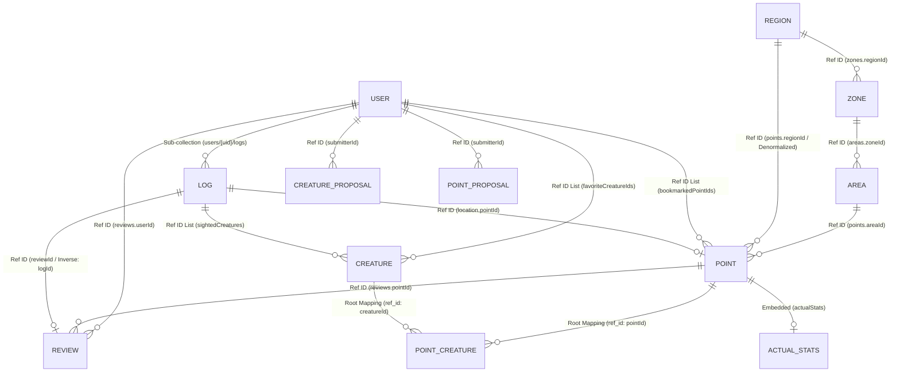

# WeDive データベース設計仕様書

本ドキュメントは、WeDive アプリケーションで使用される Firestore データベースの技術仕様、命名規則、およびデータ構造を「正確かつ完全」に定義します。

---

## 1. ID 命名規則 (ID Policy)

一貫性を維持し、AI やバッチ処理による誤操作（ハルシネーション）を防ぐため、以下の規則を厳守します。

### 1.1 マスタデータ
`points`, `creatures`, `areas`, `zones`, `regions` コレクション。
- **形式**: `[プレフィックス][数字のみ]` (例: `p1766033814156`)
- **禁止事項**: **アンダースコア (`_`) は一切含めない。**
- **プレフィックス**: `p` (Point), `c` (Creature), `a` (Area), `z` (Zone), `r` (Region)

### 1.2 マッピングデータ
`point_creatures` コレクション。
- **形式**: `[PointID]_[CreatureID]` (例: `p123_c456`)
- **ルール**: 区切り文字として **アンダースコアを1つだけ** 使用する。

---

---

## 2. エンティティ関連図 (Database Structure)

### 関連用語の凡例 (Legend)
- **Sub-collection**: Firestore の物理的な階層構造。親のパス (`/users/uid`) の下に配置される。
- **Ref ID**: 他ドキュメントの ID を単一の `string` フィールドとして保持。
- **Ref ID List**: 他ドキュメントの ID を `string[]` (配列) 形式で保持。
- **Root Mapping**: 多対多を実現するため、Root に配置した中間テーブル的役割のコレクション。
- **Embedded**: 正規化せず、ドキュメント内に直接持っている属性情報（Map/独自オブジェクト）。
- **Denormalized**: 結合（Join）を避けるため、正規化を崩して重複して持たせているデータ。

---

## 3. コレクション・スキーマ詳細

### 3.1 `regions`, `zones`, `areas` (場所マスタ階層)
| フィールド | 型 | 説明 |
| :--- | :--- | :--- |
| `id` | string | `r` / `z` / `a` + 文字列（アンダースコアなし） |
| `name` | string | 名称 |
| `description` | string | (Option) 説明文 |
| `regionId` | string | (Zone, Areaのみ) 所属RegionのID |
| `zoneId` | string | (Areaのみ) 所属ZoneのID |

### 3.2 `points` (ダイビングポイント)
| フィールド | 型 | 説明 |
| :--- | :--- | :--- |
| `id` | string | `p` + 文字列（アンダースコアなし） |
| `name` | string | ポイント名 |
| `areaId` | string | 親AreaのID |
| `zoneId` | string | 親ZoneのID |
| `regionId` | string | 親RegionのID |
| `region` | string | 地域名 (冗長化) |
| `zone` | string | ゾーン名 (冗長化) |
| `area` | string | エリア名 (冗長化) |
| `level` | string | Beginner, Intermediate, Advanced |
| `maxDepth` | number | 最大水深 (m) |
| `mainDepth` | map | 推奨・みどころ水深域: `{min, max}` |
| `entryType` | string | beach, boat, entry_easy |
| `current` | string | none, weak, strong, drift |
| `topography` | array(string) | 地形タグ (sand, rock, wall, cave, muck) |
| `description` | string | 詳細説明 |
| `features` | array(string) | 特徴タグ |
| `coordinates` | map | `{lat: number, lng: number}` |
| `googlePlaceId`| string | Google Maps Place ID |
| `formattedAddress`|string| Google Maps 住所 |
| `status` | string | pending, approved, rejected |
| `submitterId` | string | 登録者UID |
| `createdAt` | string | 作成日時 (ISO8601) |
| `images` | array(string) | 画像URLリスト |
| `imageUrl` | string | メイン画像URL |
| `imageKeyword` | string | 画像検索用キーワード |
| `bookmarkCount` | number | ブックマーク数 |
| `officialStats`| map | `{visibility: [min, max], currents: string[], difficulty: string, radar: {encounter, excite, macro, comfort, visibility}}` |
| `actualStats` | map | 集計データ: `{avgRating, avgVisibility, currentCondition: {weather, wave}, seasonalRadar: {month: radar}}` |

### 3.3 `creatures` (生物マスタ)
| フィールド | 型 | 説明 |
| :--- | :--- | :--- |
| `id` | string | `c` + 文字列（アンダースコアなし） |
| `name` | string | 和名 |
| `scientificName`| string | 学名 |
| `englishName` | string | 英名 |
| `family` | string | 科目 |
| `category` | string | カテゴリ (魚類, 甲殻類, etc.) |
| `description` | string | 説明文 |
| `rarity` | string | グローバル・レア度 (Common, Rare, Epic, Legendary) |
| `imageUrl` | string | メイン画像URL |
| `tags` | array(string) | タグリスト |
| `depthRange` | map | `{min: number, max: number}` |
| `specialAttributes`| array(string) | 毒, 擬態, 夜行性 などの属性 |
| `waterTempRange`| map | `{min: number, max: number}` |
| `status` | string | pending, approved, rejected |
| `size` | string | サイズ感 |
| `season` | array(string) | 見られる季節 |
| `submitterId` | string | 登録者UID |
| `gallery` | array(string) | 追加画像URLリスト |
| `stats` | map | `{popularity, size, danger, lifespan, rarity, speed}` (1-5の数値) |
| `imageCredit` | string | 画像の著作権情報 |
| `imageLicense` | string | ライセンス情報 |
| `imageKeyword` | string | 画像検索用キーワード |

### 3.4 `point_creatures` (地点別出現生物)
| フィールド | 型 | 説明 |
| :--- | :--- | :--- |
| `id` | string | `[pointId]_[creatureId]` |
| `pointId` | string | ポイントID |
| `creatureId` | string | 生物ID |
| `localRarity` | string | その地点固有のレア度 (Common, Rare, Epic, Legendary) |
| `lastSighted` | string | 最終目撃日 (Option) |
| `status` | string | approved, pending, deletion_requested |
| `reasoning` | string | AIによる紐付け根拠 |
| `confidence` | number | AI確信度 (0.0-1.0) |

### 3.5 `users` (ユーザープロファイル)
| フィールド | 型 | 説明 |
| :--- | :--- | :--- |
| `id` | string | Firebase Auth UID |
| `name` | string | 表示名 |
| `role` | string | user, moderator, admin |
| `trustScore` | number | トラストスコア |
| `profileImage` | string | プロフィール画像URL |
| `favorites` | map | ポイント、エリア、ショップ、器材のお気に入り |
| `favoriteCreatureIds`| array(string) | お気に入り生物IDリスト |
| `wanted` | array(string) | 会いたい生物IDリスト |
| `bookmarkedPointIds` | array(string) | ブックマーク地点IDリスト |
| `certification` | map | `{orgId, rankId, date}` |
| `badges` | array(map) | `{badgeId, earnedAt}` |
| `subscription` | map | `{status: active/inactive}` |
| `agreedAt` | string | 利用規約同意日時 |
| `agreedTermsVersion`| string | 同意した規約バージョン |
| `createdAt` | string | アカウント作成日 |
| `status` | string | provisional, active, suspended, withdrawn |

### 3.6 `users/{uid}/logs` (ダイビングログ - サブコレクション)
WeDive では、スケーラビリティとクエリ効率を考慮し、ユーザーのダイビングログをルートの `logs` コレクションではなく、各ユーザーの **サブコレクション** として配置します。
| フィールド | 型 | 説明 |
| :--- | :--- | :--- |
| `id` | string | `l` + タイムスタンプ |
| `userId` | string | 所有者UID |
| `date` | string | 潜水日 (ISO8601) |
| `diveNumber` | number | 潜水本数 |
| `location` | map | `{pointId, pointName, region, shopName, lat, lng}` |
| `team` | map | `{buddy, guide, members}` |
| `time` | map | `{entry, exit, duration, surfaceInterval}` |
| `depth` | map | `{max, average}` |
| `condition` | map | `{weather, airTemp, waterTemp, transparency, wave, current, surge, waterType}` |
| `gear` | map | `{suitType, suitThickness, weight, tank}` |
| `entryType` | string | beach, boat |
| `creatureId` | string | メイン生物のID (Option) |
| `sightedCreatures` | array(string) | 目撃した生物IDのリスト |
| `photos` | array(string) | 写真URLリスト |
| `comment` | string | ログコメント |
| `isPrivate` | boolean | 非公開フラグ |
| `likeCount` | number | いいね数 |
| `likedBy` | array(string) | いいねしたユーザーUIDリスト |
| `garminActivityId` | string | Garmin連携ID (重複防止) |
| `profile` | array(map) | `{depth, temp, hr, time}` ダイブプロファイルデータ |

### 3.7 `creature_proposals`, `point_proposals` (申請データ)
各マスタのフィールドに加え、以下を保持：
| フィールド | 型 | 説明 |
| :--- | :--- | :--- |
| `targetId` | string | (更新時) 対象マスタID |
| `proposalType` | string | create, update, delete |
| `submitterId` | string | 申請者UID |
| `status` | string | pending, approved, rejected |
| `createdAt` | string | 申請日時 |

### 3.8 `ai_grounding_cache` (AI事実確認キャッシュ)
AIによる再構築結果や検索結果を保存し、費用の抑制と高速化を図る。

### 3.9 `reviews` (ポイントレビュー)
ポイントに対するユーザーの生の声と環境実測値を管理します。
| フィールド | 型 | 説明 |
| :--- | :--- | :--- |
| `id` | string | `rv` + タイムスタンプ |
| `pointId` | string | 対象ポイントID |
| `areaId` | string | (Denormalized) エリアID (集計用) |
| `zoneId` | string | (Denormalized) ゾーンID (集計用) |
| `regionId` | string | (Denormalized) リージョンID (集計用) |
| `userId` | string | 投稿者ID |
| `logId` | string | 関連ログID (任意) |
| `rating` | number | 総合満足度 (1-5) |
| `condition` | map | `{weather, wind, wave, airTemp, waterTemp}` |
| `metrics` | map | `{depthAvg, depthMax, visibility, flow, difficulty, macroWideRatio(0-100)}` |
| `radar` | map | `{encounter, excite, macro, comfort, visibility}` (1-5スコア) |
| `tags` | array(string)| 遭遇生物、地形、見どころタグ |
| `comment` | string | 感想コメント |
| `images` | array(string)| 写真URLリスト |
| `status` | string | pending, approved, rejected |
| `trustLevel` | string | standard, verified, expert, professional, official |
| `helpfulCount`| number | 「参考になった」の数 |
| `helpfulBy` | array(string)| 「参考になった」を押したユーザーのIDリスト |
| `createdAt` | string | 投稿日時 |

#### 信頼性レベル (trustLevel) 定義
| レベル | 定義 | 表示バッジ | 統計への重み (未実装) | 判定条件 |
| :--- | :--- | :--- | :--- | :--- |
| `official` | 運営・モデレーター | 🛡️ Official | 最大 (x2.0) | `user.role` が `admin` または `moderator` |
| `professional` | プロダイバー | ⚓ Professional | 特大 (x1.5) | インストラクター等の資格保有者 |
| `verified` | 潜水証明あり | ✅ Verified Log | 大 (x1.2) | `logId` が紐付けられている投稿 |
| `expert` | ベテラン | 🌟 Expert | 中 (x1.1) | `userLogsCount` が 100本以上 |
| `standard` | 一般投稿 | なし | 通常 (x1.0) | 上記以外 |

---

## 4. 外部知識インフラ (Knowledge Infrastructure)

Managed RAG (Vertex AI Search) を連携させるための設定規則です。

| 項目 | 環境変数名 | 説明 |
| :--- | :--- | :--- |
| ドラフト生成用 | `VERTEX_AI_DRAFT_DATA_STORE_IDS` | マスタ登録・検証に使用するデータストア群 (カンマ区切り) |

---

## 5. オフライン・データ管理 (Offline Data Management)

モバイルアプリ（wedive-app）においては、ネットワークが不安定なダイビングポイントでの利用を想定し、Firestore の **永続的ローカルキャッシュ (Persistent Local Cache)** を有効化しています。

### 5.1 永続化の仕組み
- **対象データ**: 一度読み込んだマスタデータ (`points`, `creatures` 等) および自身の `logs` サブコレクション。
- **挙動**: ネットワーク未接続時でも、SDK はローカルキャッシュからデータを読み出します。読み込み時にはオンライン・オフラインを問わず、保存済みのデータが即座に UI に反映され、変更がある場合のみバックグラウンドでサーバーと同期されます。

### 5.2 オフライン保存の整合性
- **Write Operation**: 圏外でのログ保存・更新は、まずローカルの永続キャッシュに書き込まれます。
- **後追い同期**: デバイスがオンラインに復帰した際、Firestore SDK が未送信の書き込み（Mutation）を自動的に順序を守ってサーバーへ反映します。
- **制約**: オフライン中の画像アップロード（Firebase Storage）は、SDK の自動リトライに依存せず、将来的にキュー管理（Phase 4 以降）で対応予定です。
