# WeDive データベース設計仕様書

本ドキュメントは、WeDive アプリケーションで使用される Firestore データベースの技術仕様、命名規則、およびデータ構造を「正確かつ完全」に定義します。

# 🛑 CRITICAL: NO FIRESTORE REALTIME LISTENERS (onSnapshot) 🛑

**STOP AND READ THIS FIRST:**

## ⚠️ ABSOLUTE PROHIBITION ⚠️

Usage of Firestore `onSnapshot` (real-time listeners) is **STRICTLY PROHIBITED** across the entire system (Web & Mobile).

### 🚫 DO NOT USE `onSnapshot`
- **Reason**: To prevent Firestore read cost explosion and memory leaks.
- **Alternative**: Use standard `getDocs` / `getDoc` for initial fetch, and rely on **Local SQLite** for subsequent reads.
- **Exception**: Firebase Auth `onAuthStateChanged` is the **ONLY** allowed listener.

**ANY CODE VIOLATING THIS RULE WILL BE REJECTED.**

---

## 1. ID 命名規則 (ID Policy)

一貫性を維持し、AI やバッチ処理による誤操作（ハルシネーション）を防ぐため、以下の規則を厳守します。

### 1.1 マスタデータ
`points`, `creatures`, `areas`, `zones`, `regions` コレクション。
- **形式**: `[プレフィックス][数字のみ]` (例: `p1766033814156`)
- **禁止事項**: **アンダースコア (`_`) は一切含めない。**
- **プレフィックス**: `p` (Point), `c` (Creature), `a` (Area), `z` (Zone), `r` (Region), `rv` (Review), `l` (Log), `propp` (PointProposal), `propc` (CreatureProposal), `proppc` (PointCreatureProposal)

### 1.2 マッピングデータ
`point_creatures` コレクション。
- **形式**: `[PointID]_[CreatureID]` (例: `p123_c456`)
- **ルール**: 区切り文字として **アンダースコアを1つだけ** 使用する。

---

## 2. コレクション・SQLite テーブル対応一覧

| Firestore コレクション | FS カラム数 | Master SQLite Table | Master カラム数 | Personal SQLite Table (my_) | Personal カラム数 |
| :--- | :---: | :--- | :---: | :--- | :---: |
| `regions` / `zones` / `areas` | 3 / 4 / 5 | `master_geography` | 13 | － | － |
| `points` | 28 | `master_points` | 34 | `my_bookmarks` / `my_mastery` | 2 / 5 |
| `creatures` | 23 | `master_creatures` | 25 | `my_favorites` | 2 |
| `point_creatures` | 8 | `master_point_creatures` | 10 | － | － |
| `reviews` | 19 | `master_point_reviews` | 21 | `my_reviews` | 12 |
| `users` | 16 | － | － | `my_settings` | 2 |
| `users/{uid}/aiConciergeTickets` | 9 | － | － | `my_ai_concierge_tickets` | 8 |
| `users/{uid}/logs` | 21 | `master_public_logs` | 24 | `my_logs` | 24 |
| `certifications` | 4 | `master_certifications` | 4 | － | － |
| `badges` | 4 | `master_badges` | 4 | － | － |
| `*_proposals` | 8 | － | － | `my_proposals` | 6 |

### **カラム数に差異がある主な理由 (Rationale)**

Firestore のドキュメント構造と SQLite のテーブル定義でカラム数が異なるのは、モバイルアプリでの「オフライン性能」と「検索速度」を最大化するための意図的な設計によるものです。

1. **ネスト構造のフラット化 (Flattening)**:
   - Firestore では `map` 型（例: `coordinates`, `depth`）で保持しているデータを、SQLite では個別の物理カラム（例: `latitude`, `longitude`, `depth_max`）として分解しています。これにより、SQL の `WHERE` 句や `ORDER BY` でのインデックス利用が可能になります。
2. **高速検索用のインデックス追加 (Pellucid Search)**:
   - マスタデータには、BigQuery 側で事前計算した `search_text`（和名・学名・英名・地域名を結合したもの）や `name_kana` カラムを追加しています。これにより、アプリ側で重い文字列結合処理を行わずに高速な部分一致検索を実現しています。
3. **結合排除のための非正規化 (Denormalization)**:
   - SQLite でのテーブル結合（JOIN）はコストが高いため、あらかじめ参照先の名称（例: `point_name`, `region_name`）をカラムとして重複保持しています。
4. **将来の互換性とフォールバック (Compatibility)**:
   - `my_logs` 等の個人データには `data_json` カラムを設けており、Firestore の生ドキュメントをそのまま保持しています。これにより、アプリのバージョンアップで新しいフィールドが追加された際も、マイグレーションなしでデータを保持・復元できます。
5. **管理用メタデータの付与 (Management)**:
   - 同期状態を管理するための `synced_at` や、ローカルでのソート順を保証するための `created_at`（Firestore の `serverTimestamp` とは別の、アプリ保存時のタイムスタンプ）を追加しています。

---

## 3. エンティティ関連図 (Database Structure)

### 関連用語の凡例 (Legend)
- **Sub-collection**: Firestore の物理的な階層構造。親のパス (`/users/uid`) の下に配置される。
- **Ref ID**: 他ドキュメントの ID を単一の `string` フィールドとして保持。
- **Ref ID List**: 他ドキュメントの ID を `string[]` (配列) 形式で保持。
- **Root Mapping**: 多対多を実現するため、Root に配置した中間テーブル的役割のコレクション。
- **Embedded**: 正規化せず、ドキュメント内に直接持っている属性情報（Map/独自オブジェクト）。
- **Denormalized**: 結合（Join）を避けるため、正規化を崩して重複して持たせているデータ。

## 9. アーキテクチャとクラス関係

以下の図は、Webおよびアプリのアーキテクチャにおける主要コンポーネント間の正確な関係とデータフローを示しています。これにより、明確さと正確性を担保します。

### 1. コンポーネントとサービスの依存関係 (クラス図)

```mermaid
classDiagram
    class AppContext {
        +initMasterData()
        +addCreatureProposal(proposal)
        +updateCreature(id, data)
        +updatePoint(id, data)
    }

    class MasterDataSyncService {
        +syncMasterData() : static
        -fallbackToLocalTables()
        -updateSQLiteDatabase(data)
    }

    class MasterDataService {
        +initialize()
        +searchPoints(text)
        +searchCreatures(text)
        +savePoint(point)
        +saveCreature(creature)
    }

    class UserDataService {
        +syncInitialData()
        +savePointProposal(proposal)
        +saveCreatureProposal(proposal)
        +saveMyProposal(type, id, data) : private
    }

    class WebSQLiteEngine {
        +importDatabase(data)
        +runAsync(sql)
        +getAllAsync(sql)
    }

    class Firestore {
        +setDoc()
        +getDocs()
    }

    class GCS {
        +getDownloadURL()
        +v1/master/latest.db.gz
    }

    %% Relationships
    AppContext ..> MasterDataSyncService : 初期化時に syncMasterData() を呼出
    AppContext ..> MasterDataService : データを読み取り (Hooks経由)
    AppContext ..> UserDataService : 書き込み・同期処理を委譲

    MasterDataSyncService ..> GCS : DBをダウンロード
    MasterDataSyncService ..> WebSQLiteEngine : バイナリインポート / テーブル作成

    MasterDataService ..> WebSQLiteEngine : キャッシュの読み書き
    UserDataService ..> Firestore : 申請 / 管理データの書き込み
    UserDataService ..> WebSQLiteEngine : my_proposals (userDb) の書き込み
```

### 2. 初期化と同期フロー (シーケンス図)

```mermaid
sequenceDiagram
    participant UI as App/Pages
    participant CTX as AppContext
    participant MDSync as MasterDataSyncService
    participant UDS as UserDataService
    participant GCS
    participant SQLite as SQLiteEngine
    participant FS as Firestore

    UI->>CTX: マウント (AppProvider)
    CTX->>MDSync: syncMasterData()
    
    rect rgb(240, 248, 255)
    note over MDSync: マスタデータ同期フェーズ
    MDSync->>GCS: メタデータ確認 & ダウンロード (v1/master/latest.db.gz)
    alt ダウンロード成功
        GCS-->>MDSync: latest.db.gz
        MDSync->>SQLite: importDatabase(解凍済みデータ)
    else ダウンロード失敗 (オフライン/404)
        MDSync->>SQLite: fallbackToLocalTables() (空スキーマ作成)
    end
    end

    CTX->>UDS: syncInitialData() (認証済みの場合)
    
    rect rgb(255, 250, 240)
    note over UDS: ユーザーデータ同期フェーズ
    UDS->>FS: 自身の提案を取得 (submitterId==me)
    FS-->>UDS: ドキュメント群
    UDS->>SQLite: saveMyProposal() (ローカル my_proposals 更新)
    
    alt 管理者ユーザー
        UDS->>FS: 管理データを取得 (未承認レビュー等)
        FS-->>UDS: ドキュメント群
        UDS->>SQLite: ローカル管理テーブルへ保存
    end
    end
    
    CTX->>UI: 準備完了 (isLoading = false)
```

### 3. ユーザー提案データのフロー (シーケンス図)

```mermaid
sequenceDiagram
    participant User
    participant Page as EditCreaturePage
    participant CTX as AppContext
    participant UDS as UserDataService
    participant FS as Firestore
    participant SQLite as SQLiteEngine (my_proposals)

    User->>Page: 「変更を提案」をクリック
    Page->>CTX: addCreatureProposal(proposalData)
    CTX->>UDS: saveCreatureProposal(userId, proposalData)
    
    rect rgb(230, 255, 230)
    note over UDS: Dual Write Strategy (同時書き込み)
    
    par Firestore 書き込み
        UDS->>FS: setDoc(creature_proposals/{id})
    and Local 書き込み
        UDS->>SQLite: saveMyProposal('creature', id, data)
        note right of SQLite: ステータス: 'pending'<br>同期日時: Now
    end
    end
    
    UDS-->>CTX: 成功
    CTX-->>Page: 成功
    Page-->>User: 「送信完了」ダイアログを表示
```

### 1. マスタデータ同期戦略 (更新版)

**以前:** Firestore `onSnapshot` リスナー（廃止・禁止）
**新戦略:** GCS + SQLite (Web: OPFS / Mobile: Native SQLite)

#### ワークフロー (バックエンド Exporter と一致):
1.  **バックエンド (Exporter)**:
    *   BigQuery Views (`v_app_points_master` 等) -> SQLite DB (`master.db`)
    *   圧縮: `gzip`
    *   アップロード: `gs://[BUCKET]/v1/master/latest.db.gz`
    *   トリガー: オンデマンド または 定期実行 (Cloud Scheduler)

2.  **クライアント (Web/App)**:
    *   **サービス**: `MasterDataSyncService` (`MasterDataService` ではなくこちらを使用)
    *   **チェック**: ローカルのチェックサム/タイムスタンプと GCS メタデータを比較。
    *   **ダウンロード**: `v1/master/latest.db.gz` を取得。
    *   **解凍**:
        *   **Web**: `DecompressionStream` または `pako`
        *   **App**: `GzipHelper` 経由の `pako`
    *   **ロード**: SQLite エンジンにインポート (Web: wa-sqlite/OPFS, App: expo-sqlite)。
    *   **フォールバック (重要)**:
        *   GCS ダウンロード失敗時 (オフライン, 404等):
        *   **アクション**: スキーマに適合した **空のテーブル** をローカルに作成する。
        *   **理由**: アプリクラッシュ ("no such table") を防ぎ、キャッシュ済みログの閲覧など限定的な機能を提供するため。

#### スキーマの一貫性
*   **正解データ (Source of Truth)**: BigQuery Views が `master.db` のスキーマを定義する。
*   **updatedAt**: クライアント編集時の楽観ロックを有効にするため、BigQuery Views に必ず含めること。

### 2. ユーザーデータと同期ポリシー (Local-First + Firestore)

#### ユーザー提案 (編集)
一般ユーザーが変更（ポイント編集、生物編集など）を提案する場合:

1.  **Firestore**: `*_proposals` コレクションに保存（管理者レビュー用）。
2.  **Local SQLite**: `my_proposals` テーブルに **同時** に保存。
    *   **理由**: 「履歴確認」の即時サポートとオフライン機能のため。
    *   **テーブル**: `my_proposals (id, type, target_id, data_json, status, synced_at)`
3.  **同期**:
    *   アプリ起動時 (`syncInitialData`)、`submitterId == me` の `*_proposals` を取得し、`my_proposals` を最新化（ステータス変更など）。
4.  **クリーンアップ**:
    *   マスタデータ同期時に、提案された変更が適用されたか確認。
    *   新しいマスタ DB に `target_id`（生物ID等）が存在し、更新内容が含まれていれば、`my_proposals` から削除（または統合済みとマーク）。

#### 管理者データ
*   **書き込み**: `saveCreature` / `savePoint` を使用してマスタデータ (Firestore `points`/`creatures`) に直接書き込む。
*   **競合解決**: 書き込み前に Firestore の `updatedAt` とローカルキャッシュを比較。
*   **ローカルキャッシュ**: 次回の GCS 同期を待たずに変更を反映するため、書き込み直後に更新必須。

### 関連用語の凡例 (Legend)
- **Sub-collection**: Firestore の物理的な階層構造。親のパス (`/users/uid`) の下に配置される。
- **Ref ID**: 他ドキュメントの ID を単一の `string` フィールドとして保持。
- **Ref ID List**: 他ドキュメントの ID を `string[]` (配列) 形式で保持。
- **Root Mapping**: 多対多を実現するため、Root に配置した中間テーブル的役割のコレクション。
- **Embedded**: 正規化せず、ドキュメント内に直接持っている属性情報（Map/独自オブジェクト）。
- **Denormalized**: 結合（Join）を避けるため、正規化を崩して重複して持たせているデータ。

---

## 4. コレクション・スキーマ詳細

### 4.1 `regions`, `zones`, `areas` (場所マスタ階層)
| フィールド | 型 | 説明 |
| :--- | :--- | :--- |
| `id` | string | `r` / `z` / `a` + 文字列（アンダースコアなし） |
| `name` | string | 名称 |
| `description` | string | (Option) 説明文 |
| `regionId` | string | (Zone, Areaのみ) 所属RegionのID |
| `zoneId` | string | (Areaのみ) 所属ZoneのID |

### 4.2 `points` (ダイビングポイント)
| フィールド | 型 | 説明 |
| :--- | :--- | :--- |
| `id` | string | `p` + 文字列（アンダースコアなし） |
| `name` | string | ポイント名 |
| `areaId` | string | 親AreaのID |
| `zoneId` | string | 親ZoneのID |
| `regionId` | string | 親RegionのID |
| `region` | string | 地域名 (冗長化) |
| `zone` | string | ゾーン名 (冗長化) |
| `area` | string | エリア名 (冗長化) |
| `level` | string | Beginner, Intermediate, Advanced |
| `maxDepth` | number | 最大水深 (m) |
| `mainDepth` | map | 推奨・みどころ水深域: `{min, max}` |
| `entryType` | string | beach, boat, entry_easy |
| `current` | string | none, weak, strong, drift |
| `topography` | array(string) | 地形タグ (sand, rock, wall, cave, muck) |
| `description` | string | 詳細説明 |
| `features` | array(string) | 特徴タグ |
| `coordinates` | map | `{lat: number, lng: number}` |
| `googlePlaceId`| string | Google Maps Place ID |
| `formattedAddress`|string| Google Maps 住所 |
| `status` | string | approved（マスタは常に承認済みのみ） |
| `submitterId` | string | 登録者UID |
| `createdAt` | string | 作成日時 (ISO8601) |
| `updatedAt` | string | 更新日時 (ISO8601) - 競合検知用 |
| `images` | array(string) | 画像URLリスト |
| `imageUrl` | string | メイン画像URL |
| `imageKeyword` | string | 画像検索用キーワード |
| `bookmarkCount` | number | ブックマーク数 |
| `officialStats`| map | `{visibility: [min, max], currents: string[], difficulty: string, radar: {encounter, excite, macro, comfort, visibility}}` |
| `actualStats` | map | 集計データ: `{avgRating, avgVisibility, currentCondition: {weather, wave}, seasonalRadar: {month: radar}}` |

### 4.3 `creatures` (生物マスタ)
| フィールド | 型 | 説明 |
| :--- | :--- | :--- |
| `id` | string | `c` + 文字列（アンダースコアなし） |
| `name` | string | 和名 |
| `scientificName`| string | 学名 |
| `englishName` | string | 英名 |
| `family` | string | 科目 |
| `category` | string | カテゴリ (魚類, 甲殻類, etc.) |
| `description` | string | 説明文 |
| `rarity` | string | グローバル・レア度 (Common, Rare, Epic, Legendary) |
| `imageUrl` | string | メイン画像URL |
| `tags` | array(string) | タグリスト |
| `depthRange` | map | `{min: number, max: number}` |
| `specialAttributes`| array(string) | 毒, 擬態, 夜行性 などの属性 |
| `waterTempRange`| map | `{min: number, max: number}` |
| `status` | string | approved（マスタは常に承認済みのみ） |
| `size` | string | サイズ感 |
| `season` | array(string) | 見られる季節 |
| `submitterId` | string | 登録者UID |
| `createdAt` | string | 作成日時 (ISO8601) |
| `updatedAt` | string | 更新日時 (ISO8601) - 競合検知用 |
| `gallery` | array(string) | 追加画像URLリスト |
| `stats` | map | `{popularity, size, danger, lifespan, rarity, speed}` (1-5の数値) |
| `imageCredit` | string | 画像の著作権情報 |
| `imageLicense` | string | ライセンス情報 |
| `imageKeyword` | string | 画像検索用キーワード |

### 4.4 `point_creatures` (地点別出現生物)
| フィールド | 型 | 説明 |
| :--- | :--- | :--- |
| `id` | string | `[pointId]_[creatureId]` |
| `pointId` | string | ポイントID |
| `creatureId` | string | 生物ID |
| `localRarity` | string | その地点固有のレア度 (Common, Rare, Epic, Legendary) |
| `lastSighted` | string | 最終目撃日 (Option) |
| `status` | string | approved または 論理削除の rejected |
| `updatedAt` | string | 更新日時 (ISO8601) |
| `reasoning` | string | AIによる紐付け根拠 |
| `confidence` | number | AI確信度 (0.0-1.0) |

### 4.5 `users` (ユーザープロファイル)
| フィールド | 型 | 説明 |
| :--- | :--- | :--- |
| `id` | string | Firebase Auth UID |
| `name` | string | 表示名 |
| `role` | string | user, moderator, admin |
| `trustScore` | number | トラストスコア |
| `profileImage` | string | プロフィール画像URL |
| `favorites` | map | ポイント、エリア、ショップ、器材のお気に入り |
| `favoriteCreatureIds`| array(string) | お気に入り生物IDリスト |
| `wanted` | array(string) | 会いたい生物IDリスト |
| `bookmarkedPointIds` | array(string) | ブックマーク地点IDリスト |
| `certification` | map | `{orgId, rankId, date}` |
| `badges` | array(map) | `{badgeId, earnedAt}` |
| `subscription` | map | `{status: active/inactive}` |
| `aiConciergeTickets` | map | `{totalAvailable, lastDailyGrant, periodContribution: {points, creatures, reviews}}` (UIサマリー用) |
| `agreedAt` | string | 利用規約同意日時 |
| `agreedTermsVersion`| string | 同意した規約バージョン |
| `createdAt` | string | アカウント作成日 |
| `status` | string | provisional, active, suspended, withdrawn |

### 4.6 `users/{uid}/aiConciergeTickets` (AIコンシェルジュ・チケット - サブコレクション)
AIコンシェルジュ（チャット）の利用権を管理します。一回使い切りのチケット形式で、有効期限を持ちます。
| フィールド | 型 | 説明 |
| :--- | :--- | :--- |
| `id` | string | ドキュメントID |
| `type` | string | `daily` (ログイン), `contribution` (貢献), `bonus` (特別), `purchased` (購入) |
| `count` | number | 付与されたチケット数 |
| `remainingCount`| number | 残りのチケット数 |
| `grantedAt` | string | 付与日時 (ISO8601) |
| `expiresAt` | string | 有効期限 (ISO8601 / 使用期限なしの場合は null) |
| `status` | string | `active`, `used`, `expired` |
| `reason` | string | 付与理由（例: "伊豆海洋公園 ポイント登録承認"） |
| `metadata` | map | キャンペーンID等の追加情報 |

### 4.7 `users/{uid}/logs` (ダイビングログ - サブコレクション)
WeDive では、スケーラビリティとクエリ効率を考慮し、ユーザーのダイビングログをルートの `logs` コレクションではなく、各ユーザーの **サブコレクション** として配置します。
| フィールド | 型 | 説明 |
| :--- | :--- | :--- |
| `id` | string | `l` + タイムスタンプ |
| `userId` | string | 所有者UID |
| `date` | string | 潜水日 (ISO8601) |
| `diveNumber` | number | 潜水本数 |
| `location` | map | `{pointId, pointName, region, shopName, lat, lng}` |
| `team` | map | `{buddy, guide, members}` |
| `time` | map | `{entry, exit, duration, surfaceInterval}` |
| `depth` | map | `{max, average}` |
| `condition` | map | `{weather, airTemp, waterTemp, transparency, wave, current, surge, waterType}` |
| `gear` | map | `{suitType, suitThickness, weight, tank}` |
| `entryType` | string | beach, boat |
| `creatureId` | string | メイン生物のID (Option) |
| `sightedCreatures` | array(string) | 目撃した生物IDのリスト |
| `photos` | array(string) | 写真URLリスト |
| `comment` | string | ログコメント |
| `isPrivate` | boolean | 非公開フラグ |
| `likeCount` | number | いいね数 |
| `likedBy` | array(string) | いいねしたユーザーUIDリスト |
| `garminActivityId` | string | Garmin連携ID (重複防止) |
| `reviewId` | string | 関連レビューID (双方向リンク用) |
| `profile` | array(map) | `{depth, temp, hr, time}` ダイブプロファイルデータ |

### 4.8 `reviews` (ポイントレビュー)
ポイントに対するユーザーの生の声と環境実測値を管理します。
| フィールド | 型 | 説明 |
| :--- | :--- | :--- |
| `id` | string | `rv` + タイムスタンプ |
| `pointId` | string | 対象ポイントID |
| `areaId`, `zoneId`, `regionId` | string | (Denormalized) 階層ID (集計用) |
| `userId` | string | 投稿者ID |
| `logId` | string | 関連ログID (任意) |
| `rating` | number | 総合満足度 (1-5) |
| `condition` | map | `{weather, wind, wave, airTemp, waterTemp}` |
| `metrics` | map | `{depthAvg, depthMax, visibility, flow, difficulty, macroWideRatio}` |
| `radar` | map | `{encounter, excite, macro, comfort, visibility}` (1-5スコア) |
| `tags` | array(string)| 遭遇生物、地形、見どころタグ |
| `comment` | string | 感想コメント |
| `images` | array(string)| 写真URLリスト |
| `status` | string | pending, approved, rejected |
| `trustLevel` | string | standard, verified, expert, professional, official |
| `helpfulCount`| number | 「参考になった」の数 |
| `helpfulBy` | array(string)| ユーザーIDリスト |
| `createdAt` | string | 投稿日時 |

### 4.9 `ai_grounding_cache` (AI事実確認キャッシュ)
AIによる再構築結果や検索結果を保存し、費用の抑制と高速化を図る。
| フィールド | 型 | 説明 |
| :--- | :--- | :--- |
| `id` | string | クエリハッシュ等 |
| `query` | string | 検索クエリ |
| `result` | map | 検索結果データ |
| `expiresAt` | string | 有効期限 |

### 4.10 `*_proposals` (マスタ申請データ群)
`creature_proposals`, `point_proposals` など。
| フィールド | 型 | 説明 |
| :--- | :--- | :--- |
| `id` | string | `propc` / `propp` + タイムスタンプ |
| `targetId` | string | 対象マスタID |
| `proposalType` | string | create, update, delete |
| `diffData` | map | (Update時) 変更後のフィールド差分 |
| `submitterId` | string | 申請者UID |
| `status` | string | pending, approved, rejected |
| `createdAt`, `processedAt` | string | 申請日時 / 承認・却下日時 |

### 4.11 `point_creature_proposals` (ポイント-生物紐付け申請)
| フィールド | 型 | 説明 |
| :--- | :--- | :--- |
| `id` | string | `proppc` + タイムスタンプ |
| `pointId`, `creatureId` | string | 対象ID |
| `localRarity` | string | 提案するレア度 |
| `proposalType` | string | create, delete |
| `targetId` | string | 予約ID `pointId_creatureId` |
| `submitterId` | string | 申請者UID |
| `status` | string | pending, approved, rejected |
| `createdAt`, `processedAt` | string | 申請日時 / 承認・却下日時 |
| `reasoning` | string | (Option) 申請理由・根拠 |

### 4.12 `certifications` (認定資格マスタ)
| フィールド | 型 | 説明 |
| :--- | :--- | :--- |
| `id` | string | `cert` + 文字列 |
| `name` | string | 資格名 (例: Open Water Diver) |
| `organization` | string | 団体名 (PADI, NAUI, etc.) |
| `ranks` | array(map) | `{rankId, name}` ランク情報のリスト |

### 4.13 `badges` (バッジマスタ)
| フィールド | 型 | 説明 |
| :--- | :--- | :--- |
| `id` | string | `bdg` + 文字列 |
| `name` | string | バッジ名称 |
| `iconUrl` | string | アイコン画像URL |
| `condition` | map | 獲得条件定義 |

### 4.14 管理機能におけるデータフロー (Admin Data Flow)

管理者（Admin/Moderator）用のデータ操作も、Local-First の原則に従い **SQLite をプライマリ・ストレージ**とする。Firestore への直接アクセスは、初期同期と確定した書き込みのみに限定する。

#### 1. データカテゴリと同期方針
| カテゴリ | 同期・取得タイミング | 書き込みフロー |
| :--- | :--- | :--- |
| **申請データ** (Proposals) | 初回ログイン時の一括取得 (getDocs) | Firestore 更新 + ローカル削除 |
| **マスタ編集** (Direct CRUD) | 初期同期 (GCS) + 差分更新 | Firestore 更新 + ローカル SQLite 更新 (UPDATE) |
| **ユーザー管理** (User Management) | 初回ログイン時の一括取得 (getDocs) | Firestore 更新 + ローカルキャッシュ更新 |

#### 2. 管理者による承認・却下フロー (Approval Flow)
1.  **表示**: `admin_cache` テーブル（SQLite）から申請一覧を表示。 
2.  **アクション**:
    - Firestore の `*_proposals` ドキュメントを更新。
    - 承認の場合、該当するマスタコレクション（`points` 等）へ `setDoc` / `updateDoc`。
    - **整合性確保**: アクション成功後、ローカル SQLite から該当する候補レコード (`admin_creature_proposals` 等) を **物理削除**。また、承認したデータがポイント等の場合は、管理者のローカル `master.db` も更新する。

#### 3. マスタデータの直接メンテナンスフロー (Direct CRUD / Area Cleansing)
1.  **直接編集**: `AdminAreaCleansingPage` 等からの直接的な名称変更、統合、削除。
2.  **整合性確保 (副作用の伝搬)**:
    - **Firestore**: `writeBatch` を使用し、対象ドキュメントだけでなく、紐付く denormalized field（例: `areaId` を書き換えた際の Point 内の `area` 文字列）をすべて一括更新する。
    - **Local SQLite**: 管理者のブラウザ上にある `master.db` に対して、同一の UPDATE/DELETE 文を実行し、再起動なしで最新状態を反映させる。
3.  **データ復旧 (Hard Reset)**:
    - 必要に応じて Firestore の全ドキュメントを削除し、完全なシードデータから再構築する。この際、全ユーザーに対して次回の起動時にマスタの再ダウンロードを促す。

#### 4.16 複数管理者間での競合解決 (Multi-Admin Conflict Resolution)

複数の管理者が同時に操作する際の整合性は、操作対象の「バージョン（日時）」を比較する楽観的ロック方式で担保する。

1.  **承認フローの競合回避 (Proposal Check)**:
    - 承認・却下ボタン実行時に、Firestore 上の該当する `proposal` ドキュメントを取得。
    - **チェック**: `status` が `pending` か、または `processedAt` が空であることを確認。
    - すでに処理済みの場合は「この申請は既に他の管理者によって処理されました」と通知し、処理を中断する。

2.  **直接編集の競合回避 (Master Record Check)**:
    - エリア情報の変更やポイントの削除など、マスタを直接操作する場合。
    - **比較**: Firestore 上のマスタレコード（Point/Creature等）の `updatedAt` を取得し、ローカルの保持値と比較。
    - **不一致**: 「他の管理者がこのマスタを更新しました」と通知し、最新データを再読み込みする。

3.  **整合性維持**:
    - 承認処理が成功した際、該当するマスタデータの `updatedAt` も同時に更新・同期し、次に直接編集を行う管理者が古い版を元にしないよう防衛する。

---

## 5. SQLite テーブル定義 (Local Storage)

Local-First 実装において、Web/App 共通で利用される物理テーブル定義。

### 5.1 Master Data (`master.db`)
Firebase Storage (GCS) から配信され、全ユーザーが読み取り専用で利用する共通マスタ。

#### `master_geography` (Area/Zone/Region Integrated)
設計書およびExporterの実装に基づき、地理階層は1つのテーブルに集約されています。
| フィールド | 型 | 説明 |
| :--- | :--- | :--- |
| `area_id` | TEXT | エリアID |
| `area_name` | TEXT | エリア名 |
| `zone_id` | TEXT | ゾーンID |
| `zone_name` | TEXT | ゾーン名 |
| `region_id` | TEXT | リージョンID |
| `region_name` | TEXT | リージョン名 |
| `full_path` | TEXT | 検索用パス文字列 |

| `scientific_name` | TEXT | 学名 |
| `rarity` | TEXT | レア度 |
| `updated_at` | TEXT | 最終更新日時 |

### 5.2 Personal Data (`user.db`)
#### `my_logs`
| フィールド | 型 | 説明 |
| :--- | :--- | :--- |
| `id` | TEXT PRIMARY KEY | ログID |
| `date` | TEXT | 潜水日 |
| `point_id` | TEXT | 地点ID |
| `data_json` | TEXT | 全データ |
| `synced_at` | TEXT | 最終同期日時 |

#### `my_settings`
設定キーとJSON値。

#### `my_ai_concierge_tickets`
| フィールド | 型 | 説明 |
| :--- | :--- | :--- |
| `id` | TEXT PRIMARY KEY | チケットID |
| `remaining_count` | INTEGER | 残数 |
| `expires_at` | TEXT | 有効期限 |

### 5.3 Administrative Data (`admin_cache.db`)
管理者用キャッシュ（申請データ等）。

---

## 6. インデックス設計 (Index Design)

Firestore のクエリ性能を最適化するための複合インデックス。

| コレクションID | 対象フィールドと順序 | 用途 |
| :--- | :--- | :--- |
| `logs` | `isPrivate` (Asc.), `date` (Desc.), `__name__` (Desc.) | マイページ一覧 |
| `reviews` | `status` (Asc.), `createdAt` (Desc.), `__name__` (Desc.) | ポイント詳細 |
| `reviews` | `userId` (Asc.), `createdAt` (Desc.), `__name__` (Desc.) | マイレビュー |

---

## 7. 外部知識インフラ (Knowledge Infrastructure)

Managed RAG (Vertex AI Search) 連携用設定。
`VERTEX_AI_DRAFT_DATA_STORE_IDS`: マスタ登録・検証用データストアID。

---

## 8. データ整合性和同期設計 (Integrity & Sync Design)

### 8.1 基本原則
WeDive は **Local-First（ローカルファースト）** アーキテクチャを採用しています。
Firestore からのマスタデータの直接読み取りは **厳格に禁止** されています。

### 8.2 マスタデータの同期戦略
1.  **データソース**: GCS 上の `v1/master/latest.db.gz`。
2.  **クライアント処理**: `MasterDataSyncService` がダウンロード、解凍 (`pako`/`GzipHelper`)、SQLite へのインポートを行います。
3.  **フォールバック**: ダウンロード失敗時は、ローカルに **空のテーブル** (`master_geography` 等) を作成し、アプリがクラッシュしないようにします。

### 8.3 ユーザーデータの同期戦略 (Personal)
1.  **初期同期**: 起動時 (`syncInitialData`) に、`logs`、`reviews`、`tickets`、`proposals` を Firestore から取得します。
2.  **保存先**: `user.db` (`my_logs`, `my_reviews` 等) に保存します。
3.  **申請データ**: Firestore への書き込みと同時に、ローカルの `my_proposals` にも保存する「Dual-Write」を行います。

### 8.4 重要なデータの一貫性 (Transaction Policy)
チケット消費やユーザー情報更新など、資産性のあるデータについては、以下の4モデル間の一貫性を保証します。

1. **Firestore (詳細)**: チケット実体など
2. **Firestore (サマリー)**: ユーザー保有数など
3. **ローカル SQLite (詳細)**: オフライン用キャッシュ
4. **ローカル SQLite (サマリー)**: 画面表示用キャッシュ

**実装ルール:**
*   **アトミックな更新**: Firestore 上の関連データ（詳細とサマリー）は、必ず `runTransaction` を用いて矛盾なく同時に更新すること。
*   **ローカル同期の徹底**: Firestore の更新成功直後に、必ずローカル SQLite も更新すること。これを怠るとユーザーに誤った残高が表示される。
*   **自動修復**: データのズレ（不整合）を検知した場合、Firestore の状態を正としてローカルを自動補正するロジックを組み込むこと。

---

## 9. アーキテクチャとクラス関係

### 9.1 コンポーネントとサービスの依存関係

```mermaid
classDiagram
    %% --- 抽象層 (Shared Library: wedive-shared) ---
    class SQLiteExecutor {
        <<Interface>>
        +getAllAsync(sql, params)
        +runAsync(sql, params)
        +initialize(dbName)
    }

    class BaseMasterDataService {
        <<Abstract>>
        #sqlite : SQLiteExecutor
        +constructor(sqlite: SQLiteExecutor)
        +searchPoints(text) : Point[]
        +searchCreatures(text) : Creature[]
        +getAgencies() : Agency[]
        #mapPointFromSQLite(row)
        #mapCreatureFromSQLite(row)
    }

    %% --- 実装層 (Web/App Local) ---
    class WebSQLiteEngine {
        +getAllAsync()
        +runAsync()
        +initialize()
    }
    
    class WebMasterDataService {
        -isInitialized : boolean
        +initialize()
        +searchPoints(text) : Override (Super + Fallback)
        +searchCreatures(text) : Override (Super + Fallback)
        +getAgencies() : Override (Super + Fallback)
        +getAllPoints()
        +updatePointInCache(point)
    }

    %% --- 依存と継承 ---
    SQLiteExecutor <|.. WebSQLiteEngine : Implements
    BaseMasterDataService <|-- WebMasterDataService : 継承 (SQLロジックの共通化)
    BaseMasterDataService o-- SQLiteExecutor : 依存注入 (プラットフォーム非依存)
    WebMasterDataService ..> WebSQLiteEngine : 利用 (superへ渡す)

    %% --- 利用者 ---
    class AppContext {
        +initMasterData()
    }
    AppContext ..> WebMasterDataService : Calls
```

### 9.2 初期化と同期フロー

```mermaid
sequenceDiagram
    participant UI
    participant CTX as AppContext
    participant MDSync as MasterDataSyncService
    participant UDS as UserDataService
    participant GCS
    participant SQLite

    UI->>CTX: マウント
    CTX->>MDSync: syncMasterData()
    MDSync->>GCS: latest.db.gz のダウンロード
    alt 成功
        MDSync->>SQLite: DBインポート
    else 失敗
        MDSync->>SQLite: 空テーブル作成 (master_geography...)
    end
    CTX->>UDS: syncInitialData()
    UDS->>SQLite: my_logs, my_proposals 等の更新
    CTX->>UI: 準備完了
```

### 9.3 ユーザー申請データのフロー

```mermaid
sequenceDiagram
    participant User
    participant Page
    participant UDS as UserDataService
    participant FS as Firestore
    participant SQLite

    User->>Page: 変更を提案
    Page->>UDS: saveCreatureProposal()
    par Firestore
        UDS->>FS: setDoc(*_proposals)
    and Local
        UDS->>SQLite: insert(my_proposals)
    end
    Page-->>User: 完了
```

### 9.4 アプリ固有アーキテクチャ
Web版の OPFS と異なり、ネイティブアプリでは `FileSystem` と `GzipHelper` を使用して効率的なファイル操作を行います。

### 9.5 個人データとAIコンシェルジュのフロー

```mermaid
sequenceDiagram
    participant User
    participant UI
    participant BE as Cloud Functions
    participant FS as Firestore
    participant App as AppContext

    User->>UI: チャット送信
    UI->>BE: callFunction
    BE->>FS: チケット確認と消費 (Transaction)
    BE-->>UI: レスポンス
    UI->>App: syncTickets (整合性確保)
    App->>FS: 最新チケット情報の取得
    App->>UI: 表示更新
```

-----
