# WeDive データベース設計仕様書

本ドキュメントは、WeDive アプリケーションで使用される Firestore データベースの技術仕様、命名規則、およびデータ構造を「正確かつ完全」に定義します。

---

## 1. ID 命名規則 (ID Policy)

一貫性を維持し、AI やバッチ処理による誤操作（ハルシネーション）を防ぐため、以下の規則を厳守します。

### 1.1 マスタデータ
`points`, `creatures`, `areas`, `zones`, `regions` コレクション。
- **形式**: `[プレフィックス][数字のみ]` (例: `p1766033814156`)
- **禁止事項**: **アンダースコア (`_`) は一切含めない。**
- **プレフィックス**: `p` (Point), `c` (Creature), `a` (Area), `z` (Zone), `r` (Region), `rv` (Review), `l` (Log), `propp` (PointProposal), `propc` (CreatureProposal), `proppc` (PointCreatureProposal)

### 1.2 マッピングデータ
`point_creatures` コレクション。
- **形式**: `[PointID]_[CreatureID]` (例: `p123_c456`)
- **ルール**: 区切り文字として **アンダースコアを1つだけ** 使用する。

---

## 2. コレクション・SQLite テーブル対応一覧

| Firestore コレクション | FS カラム数 | Master SQLite Table | Master カラム数 | Personal SQLite Table (my_) | Personal カラム数 |
| :--- | :---: | :--- | :---: | :--- | :---: |
| `regions` / `zones` / `areas` | 3 / 4 / 5 | `master_geography` | 13 | － | － |
| `points` | 28 | `master_points` | 34 | `my_bookmarks` / `my_mastery` | 2 / 5 |
| `creatures` | 23 | `master_creatures` | 25 | `my_favorites` | 2 |
| `point_creatures` | 8 | `master_point_creatures` | 10 | － | － |
| `reviews` | 19 | `master_point_reviews` | 21 | `my_reviews` | 12 |
| `users` | 16 | － | － | `my_settings` | 2 |
| `users/{uid}/aiConciergeTickets` | 9 | － | － | `my_ai_concierge_tickets` | 8 |
| `users/{uid}/logs` | 21 | `master_public_logs` | 24 | `my_logs` | 24 |
| `certifications` | 4 | `master_certifications` | 4 | － | － |
| `badges` | 4 | `master_badges` | 4 | － | － |
| `*_proposals` | 8 | － | － | `my_proposals` | 6 |

### **カラム数に差異がある主な理由 (Rationale)**

Firestore のドキュメント構造と SQLite のテーブル定義でカラム数が異なるのは、モバイルアプリでの「オフライン性能」と「検索速度」を最大化するための意図的な設計によるものです。

1. **ネスト構造のフラット化 (Flattening)**:
   - Firestore では `map` 型（例: `coordinates`, `depth`）で保持しているデータを、SQLite では個別の物理カラム（例: `latitude`, `longitude`, `depth_max`）として分解しています。これにより、SQL の `WHERE` 句や `ORDER BY` でのインデックス利用が可能になります。
2. **高速検索用のインデックス追加 (Pellucid Search)**:
   - マスタデータには、BigQuery 側で事前計算した `search_text`（和名・学名・英名・地域名を結合したもの）や `name_kana` カラムを追加しています。これにより、アプリ側で重い文字列結合処理を行わずに高速な部分一致検索を実現しています。
3. **結合排除のための非正規化 (Denormalization)**:
   - SQLite でのテーブル結合（JOIN）はコストが高いため、あらかじめ参照先の名称（例: `point_name`, `region_name`）をカラムとして重複保持しています。
4. **将来の互換性とフォールバック (Compatibility)**:
   - `my_logs` 等の個人データには `data_json` カラムを設けており、Firestore の生ドキュメントをそのまま保持しています。これにより、アプリのバージョンアップで新しいフィールドが追加された際も、マイグレーションなしでデータを保持・復元できます。
5. **管理用メタデータの付与 (Management)**:
   - 同期状態を管理するための `synced_at` や、ローカルでのソート順を保証するための `created_at`（Firestore の `serverTimestamp` とは別の、アプリ保存時のタイムスタンプ）を追加しています。

---

## 3. エンティティ関連図 (Database Structure)

### 関連用語の凡例 (Legend)
- **Sub-collection**: Firestore の物理的な階層構造。親のパス (`/users/uid`) の下に配置される。
- **Ref ID**: 他ドキュメントの ID を単一の `string` フィールドとして保持。
- **Ref ID List**: 他ドキュメントの ID を `string[]` (配列) 形式で保持。
- **Root Mapping**: 多対多を実現するため、Root に配置した中間テーブル的役割のコレクション。
- **Embedded**: 正規化せず、ドキュメント内に直接持っている属性情報（Map/独自オブジェクト）。
- **Denormalized**: 結合（Join）を避けるため、正規化を崩して重複して持たせているデータ。

## Architecture & Class Relationships

The following diagrams illustrate the exact relationships and data flow between key components in the Web/App architecture, ensuring Clarity and Correctness.

### 1. Component & Service Dependency (Class Diagram)

```mermaid
classDiagram
    class AppContext {
        +initMasterData()
        +addCreatureProposal(proposal)
        +updateCreature(id, data)
        +updatePoint(id, data)
    }

    class MasterDataSyncService {
        +syncMasterData() : static
        -fallbackToLocalTables()
        -updateSQLiteDatabase(data)
    }

    class MasterDataService {
        +initialize()
        +searchPoints(text)
        +searchCreatures(text)
        +savePoint(point)
        +saveCreature(creature)
    }

    class UserDataService {
        +syncInitialData()
        +savePointProposal(proposal)
        +saveCreatureProposal(proposal)
        +saveMyProposal(type, id, data) : private
    }

    class WebSQLiteEngine {
        +importDatabase(data)
        +runAsync(sql)
        +getAllAsync(sql)
    }

    class Firestore {
        +setDoc()
        +getDocs()
    }

    class GCS {
        +getDownloadURL()
        +v1/master/latest.db.gz
    }

    %% Relationships
    AppContext ..> MasterDataSyncService : Calls syncMasterData() on Init
    AppContext ..> MasterDataService : Reads Data (via hooks)
    AppContext ..> UserDataService : Delegate Write/Sync Actions

    MasterDataSyncService ..> GCS : Downloads DB
    MasterDataSyncService ..> WebSQLiteEngine : Imports Binary / Creates Tables

    MasterDataService ..> WebSQLiteEngine : Reads/Writes Cache
    UserDataService ..> Firestore : Writes Proposals / Admin Data
    UserDataService ..> WebSQLiteEngine : Writes my_proposals (userDb)
```

### 2. Initialization & Sync Flow (Sequence Diagram)

### 3. User Proposal Data Flow (Sequence Diagram)

### 1. Master Data Synchronization Strategy (Updated)

**Previously:** Firestore `onSnapshot` listener (Deprecated & Forbidden).
**New Strategy:** GCS + SQLite (Web: OPFS / Mobile: Native SQLite).

#### Workflow matches Backend Exporter:
1.  **Backend (Exporter)**:
    *   BigQuery Views (`v_app_points_master` etc.) -> SQLite DB (`master.db`)
    *   Compression: `gzip`
    *   Upload: `gs://[BUCKET]/v1/master/latest.db.gz`
    *   Trigger: On-demand or Scheduled (Cloud Scheduler).

2.  **Client (Web/App)**:
    *   **Service**: `MasterDataSyncService` (Use this, NOT `MasterDataService`)
    *   **Check**: Compare local checksum/timestamp vs GCS Metadata.
    *   **Download**: Fetch `v1/master/latest.db.gz`.
    *   **Decompress**:
        *   **Web**: `DecompressionStream` or `pako`
        *   **App**: `pako` via `GzipHelper`
    *   **Load**: Import into SQLite engine (Web: wa-sqlite/OPFS, App: expo-sqlite).
    *   **Fallback (CRITICAL)**:
        *   If GCS download fails (Offline, 404, etc.):
        *   **Action**: Create **EMPTY TABLES** locally conforming to the schema.
        *   **Reason**: Prevents app crash ("no such table") and allows limited functionality (e.g. viewing cached logs).

#### Schema Consistency
*   **Source of Truth**: BigQuery Views define the schema of `master.db`.
*   **updatedAt**: MUST be included in BigQuery Views to enable Optimistic Locking on client edits.

### 2. User Data & Sync Policy (Local-First + Firestore)

#### User Proposals (Edits)
When a general user proposes a change (e.g. Edit Point, Edit Creature):
1.  **Firestore**: Save to `*_proposals` collection (for Admin review).
2.  **Local SQLite**: Save to `my_proposals` table **simultaneously**.
    *   Reason: Immediate "Show my history" support and Offline capability.
    *   Table: `my_proposals (id, type, target_id, data_json, status, synced_at)`
3.  **Sync**:
    *   On App launch (`syncInitialData`), fetch `*_proposals` where `submitterId == me` to keep `my_proposals` up-to-date (status changes).
4.  **Cleanup**:
    *   Upon Master Data Sync, check if proposed changes are applied.
    *   If `target_id` (e.g. creature ID) exists in new Master DB with updated content, remove from `my_proposals` (or mark as Merged).

#### Admin Data
*   **Admins** write directly to Master Data (Firestore `points`/`creatures`) using `saveCreature`/`savePoint`.
*   **Conflict Resolution**: Check `updatedAt` in Firestore vs Local Cache before writing.
*   **Local Cache**: Must be updated immediately after write to reflect changes without waiting for next GCS Sync.

### 関連用語の凡例 (Legend)
- **Sub-collection**: Firestore の物理的な階層構造。親のパス (`/users/uid`) の下に配置される。
- **Ref ID**: 他ドキュメントの ID を単一の `string` フィールドとして保持。
- **Ref ID List**: 他ドキュメントの ID を `string[]` (配列) 形式で保持。
- **Root Mapping**: 多対多を実現するため、Root に配置した中間テーブル的役割のコレクション。
- **Embedded**: 正規化せず、ドキュメント内に直接持っている属性情報（Map/独自オブジェクト）。
- **Denormalized**: 結合（Join）を避けるため、正規化を崩して重複して持たせているデータ。

---

## 4. コレクション・スキーマ詳細

### 4.1 `regions`, `zones`, `areas` (場所マスタ階層)
| フィールド | 型 | 説明 |
| :--- | :--- | :--- |
| `id` | string | `r` / `z` / `a` + 文字列（アンダースコアなし） |
| `name` | string | 名称 |
| `description` | string | (Option) 説明文 |
| `regionId` | string | (Zone, Areaのみ) 所属RegionのID |
| `zoneId` | string | (Areaのみ) 所属ZoneのID |

### 4.2 `points` (ダイビングポイント)
| フィールド | 型 | 説明 |
| :--- | :--- | :--- |
| `id` | string | `p` + 文字列（アンダースコアなし） |
| `name` | string | ポイント名 |
| `areaId` | string | 親AreaのID |
| `zoneId` | string | 親ZoneのID |
| `regionId` | string | 親RegionのID |
| `region` | string | 地域名 (冗長化) |
| `zone` | string | ゾーン名 (冗長化) |
| `area` | string | エリア名 (冗長化) |
| `level` | string | Beginner, Intermediate, Advanced |
| `maxDepth` | number | 最大水深 (m) |
| `mainDepth` | map | 推奨・みどころ水深域: `{min, max}` |
| `entryType` | string | beach, boat, entry_easy |
| `current` | string | none, weak, strong, drift |
| `topography` | array(string) | 地形タグ (sand, rock, wall, cave, muck) |
| `description` | string | 詳細説明 |
| `features` | array(string) | 特徴タグ |
| `coordinates` | map | `{lat: number, lng: number}` |
| `googlePlaceId`| string | Google Maps Place ID |
| `formattedAddress`|string| Google Maps 住所 |
| `status` | string | approved（マスタは常に承認済みのみ） |
| `submitterId` | string | 登録者UID |
| `createdAt` | string | 作成日時 (ISO8601) |
| `updatedAt` | string | 更新日時 (ISO8601) - 競合検知用 |
| `images` | array(string) | 画像URLリスト |
| `imageUrl` | string | メイン画像URL |
| `imageKeyword` | string | 画像検索用キーワード |
| `bookmarkCount` | number | ブックマーク数 |
| `officialStats`| map | `{visibility: [min, max], currents: string[], difficulty: string, radar: {encounter, excite, macro, comfort, visibility}}` |
| `actualStats` | map | 集計データ: `{avgRating, avgVisibility, currentCondition: {weather, wave}, seasonalRadar: {month: radar}}` |

### 4.3 `creatures` (生物マスタ)
| フィールド | 型 | 説明 |
| :--- | :--- | :--- |
| `id` | string | `c` + 文字列（アンダースコアなし） |
| `name` | string | 和名 |
| `scientificName`| string | 学名 |
| `englishName` | string | 英名 |
| `family` | string | 科目 |
| `category` | string | カテゴリ (魚類, 甲殻類, etc.) |
| `description` | string | 説明文 |
| `rarity` | string | グローバル・レア度 (Common, Rare, Epic, Legendary) |
| `imageUrl` | string | メイン画像URL |
| `tags` | array(string) | タグリスト |
| `depthRange` | map | `{min: number, max: number}` |
| `specialAttributes`| array(string) | 毒, 擬態, 夜行性 などの属性 |
| `waterTempRange`| map | `{min: number, max: number}` |
| `status` | string | approved（マスタは常に承認済みのみ） |
| `size` | string | サイズ感 |
| `season` | array(string) | 見られる季節 |
| `submitterId` | string | 登録者UID |
| `createdAt` | string | 作成日時 (ISO8601) |
| `updatedAt` | string | 更新日時 (ISO8601) - 競合検知用 |
| `gallery` | array(string) | 追加画像URLリスト |
| `stats` | map | `{popularity, size, danger, lifespan, rarity, speed}` (1-5の数値) |
| `imageCredit` | string | 画像の著作権情報 |
| `imageLicense` | string | ライセンス情報 |
| `imageKeyword` | string | 画像検索用キーワード |

### 4.4 `point_creatures` (地点別出現生物)
| フィールド | 型 | 説明 |
| :--- | :--- | :--- |
| `id` | string | `[pointId]_[creatureId]` |
| `pointId` | string | ポイントID |
| `creatureId` | string | 生物ID |
| `localRarity` | string | その地点固有のレア度 (Common, Rare, Epic, Legendary) |
| `lastSighted` | string | 最終目撃日 (Option) |
| `status` | string | approved または 論理削除の rejected |
| `updatedAt` | string | 更新日時 (ISO8601) |
| `reasoning` | string | AIによる紐付け根拠 |
| `confidence` | number | AI確信度 (0.0-1.0) |

### 4.5 `users` (ユーザープロファイル)
| フィールド | 型 | 説明 |
| :--- | :--- | :--- |
| `id` | string | Firebase Auth UID |
| `name` | string | 表示名 |
| `role` | string | user, moderator, admin |
| `trustScore` | number | トラストスコア |
| `profileImage` | string | プロフィール画像URL |
| `favorites` | map | ポイント、エリア、ショップ、器材のお気に入り |
| `favoriteCreatureIds`| array(string) | お気に入り生物IDリスト |
| `wanted` | array(string) | 会いたい生物IDリスト |
| `bookmarkedPointIds` | array(string) | ブックマーク地点IDリスト |
| `certification` | map | `{orgId, rankId, date}` |
| `badges` | array(map) | `{badgeId, earnedAt}` |
| `subscription` | map | `{status: active/inactive}` |
| `aiConciergeTickets` | map | `{totalAvailable, lastDailyGrant, periodContribution: {points, creatures, reviews}}` (UIサマリー用) |
| `agreedAt` | string | 利用規約同意日時 |
| `agreedTermsVersion`| string | 同意した規約バージョン |
| `createdAt` | string | アカウント作成日 |
| `status` | string | provisional, active, suspended, withdrawn |

### 4.6 `users/{uid}/aiConciergeTickets` (AIコンシェルジュ・チケット - サブコレクション)
AIコンシェルジュ（チャット）の利用権を管理します。一回使い切りのチケット形式で、有効期限を持ちます。
| フィールド | 型 | 説明 |
| :--- | :--- | :--- |
| `id` | string | ドキュメントID |
| `type` | string | `daily` (ログイン), `contribution` (貢献), `bonus` (特別), `purchased` (購入) |
| `count` | number | 付与されたチケット数 |
| `remainingCount`| number | 残りのチケット数 |
| `grantedAt` | string | 付与日時 (ISO8601) |
| `expiresAt` | string | 有効期限 (ISO8601 / 使用期限なしの場合は null) |
| `status` | string | `active`, `used`, `expired` |
| `reason` | string | 付与理由（例: "伊豆海洋公園 ポイント登録承認"） |
| `metadata` | map | キャンペーンID等の追加情報 |

### 4.7 `users/{uid}/logs` (ダイビングログ - サブコレクション)
WeDive では、スケーラビリティとクエリ効率を考慮し、ユーザーのダイビングログをルートの `logs` コレクションではなく、各ユーザーの **サブコレクション** として配置します。
| フィールド | 型 | 説明 |
| :--- | :--- | :--- |
| `id` | string | `l` + タイムスタンプ |
| `userId` | string | 所有者UID |
| `date` | string | 潜水日 (ISO8601) |
| `diveNumber` | number | 潜水本数 |
| `location` | map | `{pointId, pointName, region, shopName, lat, lng}` |
| `team` | map | `{buddy, guide, members}` |
| `time` | map | `{entry, exit, duration, surfaceInterval}` |
| `depth` | map | `{max, average}` |
| `condition` | map | `{weather, airTemp, waterTemp, transparency, wave, current, surge, waterType}` |
| `gear` | map | `{suitType, suitThickness, weight, tank}` |
| `entryType` | string | beach, boat |
| `creatureId` | string | メイン生物のID (Option) |
| `sightedCreatures` | array(string) | 目撃した生物IDのリスト |
| `photos` | array(string) | 写真URLリスト |
| `comment` | string | ログコメント |
| `isPrivate` | boolean | 非公開フラグ |
| `likeCount` | number | いいね数 |
| `likedBy` | array(string) | いいねしたユーザーUIDリスト |
| `garminActivityId` | string | Garmin連携ID (重複防止) |
| `reviewId` | string | 関連レビューID (双方向リンク用) |
| `profile` | array(map) | `{depth, temp, hr, time}` ダイブプロファイルデータ |

### 4.8 `reviews` (ポイントレビュー)
ポイントに対するユーザーの生の声と環境実測値を管理します。
| フィールド | 型 | 説明 |
| :--- | :--- | :--- |
| `id` | string | `rv` + タイムスタンプ |
| `pointId` | string | 対象ポイントID |
| `areaId`, `zoneId`, `regionId` | string | (Denormalized) 階層ID (集計用) |
| `userId` | string | 投稿者ID |
| `logId` | string | 関連ログID (任意) |
| `rating` | number | 総合満足度 (1-5) |
| `condition` | map | `{weather, wind, wave, airTemp, waterTemp}` |
| `metrics` | map | `{depthAvg, depthMax, visibility, flow, difficulty, macroWideRatio}` |
| `radar` | map | `{encounter, excite, macro, comfort, visibility}` (1-5スコア) |
| `tags` | array(string)| 遭遇生物、地形、見どころタグ |
| `comment` | string | 感想コメント |
| `images` | array(string)| 写真URLリスト |
| `status` | string | pending, approved, rejected |
| `trustLevel` | string | standard, verified, expert, professional, official |
| `helpfulCount`| number | 「参考になった」の数 |
| `helpfulBy` | array(string)| ユーザーIDリスト |
| `createdAt` | string | 投稿日時 |

### 4.9 `ai_grounding_cache` (AI事実確認キャッシュ)
AIによる再構築結果や検索結果を保存し、費用の抑制と高速化を図る。
| フィールド | 型 | 説明 |
| :--- | :--- | :--- |
| `id` | string | クエリハッシュ等 |
| `query` | string | 検索クエリ |
| `result` | map | 検索結果データ |
| `expiresAt` | string | 有効期限 |

### 4.10 `*_proposals` (マスタ申請データ群)
`creature_proposals`, `point_proposals` など。
| フィールド | 型 | 説明 |
| :--- | :--- | :--- |
| `id` | string | `propc` / `propp` + タイムスタンプ |
| `targetId` | string | 対象マスタID |
| `proposalType` | string | create, update, delete |
| `diffData` | map | (Update時) 変更後のフィールド差分 |
| `submitterId` | string | 申請者UID |
| `status` | string | pending, approved, rejected |
| `createdAt`, `processedAt` | string | 申請日時 / 承認・却下日時 |

### 4.11 `point_creature_proposals` (ポイント-生物紐付け申請)
| フィールド | 型 | 説明 |
| :--- | :--- | :--- |
| `id` | string | `proppc` + タイムスタンプ |
| `pointId`, `creatureId` | string | 対象ID |
| `localRarity` | string | 提案するレア度 |
| `proposalType` | string | create, delete |
| `targetId` | string | 予約ID `pointId_creatureId` |
| `submitterId` | string | 申請者UID |
| `status` | string | pending, approved, rejected |
| `createdAt`, `processedAt` | string | 申請日時 / 承認・却下日時 |
| `reasoning` | string | (Option) 申請理由・根拠 |

### 4.12 `certifications` (認定資格マスタ)
| フィールド | 型 | 説明 |
| :--- | :--- | :--- |
| `id` | string | `cert` + 文字列 |
| `name` | string | 資格名 (例: Open Water Diver) |
| `organization` | string | 団体名 (PADI, NAUI, etc.) |
| `ranks` | array(map) | `{rankId, name}` ランク情報のリスト |

### 4.13 `badges` (バッジマスタ)
| フィールド | 型 | 説明 |
| :--- | :--- | :--- |
| `id` | string | `bdg` + 文字列 |
| `name` | string | バッジ名称 |
| `iconUrl` | string | アイコン画像URL |
| `condition` | map | 獲得条件定義 |

### 4.14 管理機能におけるデータフロー (Admin Data Flow)

管理者（Admin/Moderator）用のデータ操作も、Local-First の原則に従い **SQLite をプライマリ・ストレージ**とする。Firestore への直接アクセスは、初期同期と確定した書き込みのみに限定する。

#### 1. データカテゴリと同期方針
| カテゴリ | 同期・取得タイミング | 書き込みフロー |
| :--- | :--- | :--- |
| **申請データ** (Proposals) | 初回ログイン時の一括取得 (getDocs) | Firestore 更新 + ローカル削除 |
| **マスタ編集** (Direct CRUD) | 初期同期 (GCS) + 差分更新 | Firestore 更新 + ローカル SQLite 更新 (UPDATE) |
| **ユーザー管理** (User Management) | 初回ログイン時の一括取得 (getDocs) | Firestore 更新 + ローカルキャッシュ更新 |

#### 2. 管理者による承認・却下フロー (Approval Flow)
1.  **表示**: `admin_cache` テーブル（SQLite）から申請一覧を表示。 
2.  **アクション**:
    - Firestore の `*_proposals` ドキュメントを更新。
    - 承認の場合、該当するマスタコレクション（`points` 等）へ `setDoc` / `updateDoc`。
    - **整合性確保**: アクション成功後、ローカル SQLite から該当する候補レコード (`admin_creature_proposals` 等) を **物理削除**。また、承認したデータがポイント等の場合は、管理者のローカル `master.db` も更新する。

#### 3. マスタデータの直接メンテナンスフロー (Direct CRUD / Area Cleansing)
1.  **直接編集**: `AdminAreaCleansingPage` 等からの直接的な名称変更、統合、削除。
2.  **整合性確保 (副作用の伝搬)**:
    - **Firestore**: `writeBatch` を使用し、対象ドキュメントだけでなく、紐付く denormalized field（例: `areaId` を書き換えた際の Point 内の `area` 文字列）をすべて一括更新する。
    - **Local SQLite**: 管理者のブラウザ上にある `master.db` に対して、同一の UPDATE/DELETE 文を実行し、再起動なしで最新状態を反映させる。
3.  **データ復旧 (Hard Reset)**:
    - 必要に応じて Firestore の全ドキュメントを削除し、完全なシードデータから再構築する。この際、全ユーザーに対して次回の起動時にマスタの再ダウンロードを促す。

#### 4.16 複数管理者間での競合解決 (Multi-Admin Conflict Resolution)

複数の管理者が同時に操作する際の整合性は、操作対象の「バージョン（日時）」を比較する楽観的ロック方式で担保する。

1.  **承認フローの競合回避 (Proposal Check)**:
    - 承認・却下ボタン実行時に、Firestore 上の該当する `proposal` ドキュメントを取得。
    - **チェック**: `status` が `pending` か、または `processedAt` が空であることを確認。
    - すでに処理済みの場合は「この申請は既に他の管理者によって処理されました」と通知し、処理を中断する。

2.  **直接編集の競合回避 (Master Record Check)**:
    - エリア情報の変更やポイントの削除など、マスタを直接操作する場合。
    - **比較**: Firestore 上のマスタレコード（Point/Creature等）の `updatedAt` を取得し、ローカルの保持値と比較。
    - **不一致**: 「他の管理者がこのマスタを更新しました」と通知し、最新データを再読み込みする。

3.  **整合性維持**:
    - 承認処理が成功した際、該当するマスタデータの `updatedAt` も同時に更新・同期し、次に直接編集を行う管理者が古い版を元にしないよう防衛する。

---

## 5. SQLite テーブル定義 (Local Storage)

Local-First 実装において、Web/App 共通で利用される物理テーブル定義。

### 5.1 Master Data (`master.db`)
Firebase Storage (GCS) から配信され、全ユーザーが読み取り専用で利用する共通マスタ。

#### `master_regions` / `master_zones` / `master_areas`
| フィールド | 型 | 説明 |
| :--- | :--- | :--- |
| `id` | TEXT PRIMARY KEY | 階層ID (r/z/a...) |
| `name` | TEXT | 名称 |
| `parent_id` | TEXT | 親階層のID |

#### `master_points`
| フィールド | 型 | 説明 |
| :--- | :--- | :--- |
| `id` | TEXT PRIMARY KEY | ポイントID |
| `name` | TEXT | ポイント名 |
| `name_kana` | TEXT | カナ名 (検索用) |
| `area_id` | TEXT | 所属エリアID |
| `latitude` / `longitude` | REAL | 座標 |
| `search_text` | TEXT | 高速検索用結合文字列 |
| `updated_at` | TEXT | 最終更新日時 (競合チェック用) |

#### `master_creatures`
| フィールド | 型 | 説明 |
| :--- | :--- | :--- |
| `id` | TEXT PRIMARY KEY | 生物ID |
| `name` | TEXT | 和名 |
| `scientific_name` | TEXT | 学名 |
| `family` | TEXT | 科目 |
| `rarity` | TEXT | レア度 |
| `updated_at` | TEXT | 最終更新日時 (競合チェック用) |

### 5.2 Personal Data (`user.db`)
各ユーザー固有のデータ（ログ、プロフィール、設定など）。

#### `my_logs`
| フィールド | 型 | 説明 |
| :--- | :--- | :--- |
| `id` | TEXT PRIMARY KEY | ログID |
| `date` | TEXT | 潜水日 |
| `point_id` | TEXT | 地点ID |
| `data_json` | TEXT | 全データ (Firestore ドキュメント互換) |
| `synced_at` | TEXT | 最終同期日時 |
| `updated_at` | TEXT | ローカル更新日時 |

#### `my_settings`
| フィールド | 型 | 説明 |
| :--- | :--- | :--- |
| `key` | TEXT PRIMARY KEY | 設定キー (profile, theme, etc.) |
| `value_json` | TEXT | 設定値 |

#### `my_ai_concierge_tickets`
| フィールド | 型 | 説明 |
| :--- | :--- | :--- |
| `id` | TEXT PRIMARY KEY | チケットID |
| `remaining_count` | INTEGER | 残数 |
| `expires_at` | TEXT | 有効期限 |

### 5.3 Administrative Data (`admin_cache.db` / `user.db` 内部)
管理者・モデレーターのみが保持する、審査・管理用のキャッシュデータ。

#### `admin_proposals`
| フィールド | 型 | 説明 |
| :--- | :--- | :--- |
| `id` | TEXT PRIMARY KEY | プロポーザルID |
| `type` | TEXT | `creature`, `point`, `review` 等の種別 |
| `data_json` | TEXT | 申請内容詳細 |
| `status` | TEXT | `pending` 等 |

#### `admin_users_cache`
| フィールド | 型 | 説明 |
| :--- | :--- | :--- |
| `id` | TEXT PRIMARY KEY | ユーザーID |
| `name` | TEXT | 名称 |
| `role` | TEXT | 権限レベル |
| `trust_score` | INTEGER | トラストスコア |
| `data_json` | TEXT | 全プロフィールデータ |
### 9.4 App Architecture (Native Specifics)
The Mobile App (React Native/Expo) follows the same high-level architecture but uses different underlying engines.

---

## 10. インデックス設計 (Index Design)

Firestore のクエリ性能を最適化し、複雑な絞り込み・並べ替えを実現するために以下の複合インデックスを構成します。

### 6.1 必須複合インデックス

| コレクションID | 対象フィールドと順序 | 用途 |
| :--- | :--- | :--- |
| `logs` | `isPrivate` (Asc.), `date` (Desc.), `__name__` (Desc.) | マイページ一覧表示 |
| `reviews` | `status` (Asc.), `createdAt` (Desc.), `__name__` (Desc.) | ポイント詳細表示 |
| `reviews` | `userId` (Asc.), `createdAt` (Desc.), `__name__` (Desc.) | マイレビュー一覧表示 |
| `points` | `status` (Asc.), `name` (Asc.), `__name__` (Asc.) | ポイント選択検索 |

---

## 7. 外部知識インフラ (Knowledge Infrastructure)

Managed RAG (Vertex AI Search) を連携させるための設定規則です。

| 項目 | 環境変数名 | 説明 |
| :--- | :--- | :--- |
| ドラフト生成用 | `VERTEX_AI_DRAFT_DATA_STORE_IDS` | マスタ登録・検証に使用するデータストア群 (カンマ区切り) |

---

## 8. Data Integrity & Synchronization Strategy

### 8.1 Basic Principles & Strict Policies
WeDive adopts a **Local-First** architecture. Direct reads from Firestore for Master Data are strictly prohibited.

> **AI AGENT WARNING: READ PROHIBITION**
> Do NOT use `getDocs` or `onSnapshot` for master data collections (`points`, `creatures`, etc.).
> Master Data MUST be sourced from GCS (`master.db`) and queried via SQLite.

### 8.2 Master Data Synchronization Flow

**Approved Strategy**:
1.  **Backend**: Cloud Functions exports BigQuery/Firestore data to `gs://[BUCKET]/v1/master/latest.db.gz`.
2.  **Client (MasterDataSyncService)**:
    *   **Check**: Compare local checksum/timestamp vs GCS Metadata.
    *   **Download**: Fetch `v1/master/latest.db.gz`.
    *   **Decompress**: Use `pako` or `GzipHelper` (native).
    *   **Load**: Import into SQLite engine (Web: wa-sqlite/OPFS, App: expo-sqlite).
    *   **Fallback**: If download fails, **create empty tables locally**.

### 8.3 User Data & Proposal Flow

1.  **User Proposals (Edits)**:
    *   **Action**: User submits a change (e.g. Edit Point).
    *   **Write (Firestore)**: Save to `*_proposals` collection.
    *   **Write (Local)**: **Simultaneously** insert into `my_proposals` table.
    *   **Sync**: `my_proposals` provides immediate "My History" view.

2.  **Personal Data Sync**:
    *   On App launch (`syncInitialData`), fetch personal data (`logs`, `reviews`, `proposals`) from Firestore.
    *   Update local SQLite tables (`my_logs`, `my_reviews`, `my_proposals`).

3.  **Admin Operations**:
    *   Admins write directly to Master Data (Firestore `points`/`creatures`).
    *   **Conflict Resolution**: Optimistic Locking via `updatedAt` field.
    *   **Local Cache**: Must be updated immediately after write (`Write-Through`).

## 9. Architecture & Class Relationships

### 9.1 Component & Service Dependency (Class Diagram)

### 9.2 Initialization & Sync Flow (Sequence Diagram)

### 9.3 User Proposal Data Flow (Sequence Diagram)

---
