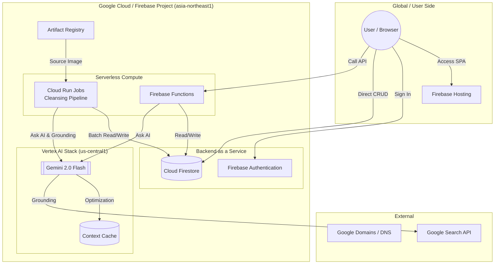

# WeDive インフラ構成仕様書

本ドキュメントは、WeDive アプリケーションのシステムアーキテクチャ、クラウドサービス、およびデプロイパイプラインについて説明します。

---

## 1. システム構成図 (Infrastructure Diagram)

WeDive のコンポーネント間の連携と、使用しているクラウドサービスの関係図です。

---

## 2. システムアーキテクチャの概要

WeDive は、主に **Google Cloud Platform (GCP)** と **Firebase** を使用したサーバーレスアーキテクチャで構築されています。

### 2.1 コンポーネント
- **フロントエンド**: React (Vite) で構築された SPA。Firebase Hosting で配信。
- **データベース**: Cloud Firestore (NoSQL)。リージョンは `asia-northeast1`。
- **計算リソース**:
  - **Firebase Functions**: API およびトリガー処理。
  - **Cloud Run Jobs**: 大規模な AI 処理バッチ（クレンジングなど）。
- **AI 連携**: Vertex AI (Gemini 2.0 Flash)。最新機能を利用するため `us-central1` を活用。

---

## 3. 使用サービス詳細

### 3.1 Vertex AI (AI 処理拠点: `us-central1`)
- **Context Caching**: 数千種類の生物・地点情報をキャッシュし、トークン料金を大幅に削減。
- **Google Search Grounding**: AI の回答に Google 検索の結果を統合し、実在する目撃例に基づいた判定を実現。

### 3.2 Cloud Run Jobs (バッチ処理拠点: `asia-northeast1`)
- Python 3.12 実行環境。
- `docker/cleansing/` 以下の Dockerfile をベースに、Artifact Registry からのイメージを使用。

### 3.3 CI/CD パイプライン
- **GitHub Actions**: 
  - `main` ブランチへのプッシュで Firebase Hosting、Functions、Cloud Run Jobs を自動デプロイ。
  - 基本認証（BASIC_AUTH）等の環境変数を GitHub Secrets で管理。

---

## 4. インフラ定数 (Infrastructure Constants)

| 項目 | 値 |
| :--- | :--- |
| プロジェクト ID (本番) | `we-dive` |
| Firestore リージョン | `asia-northeast1` |
| AI プロセッサ ロケーション | `us-central1` |
| Artifact Registry Repo | `wedive-repo` |
