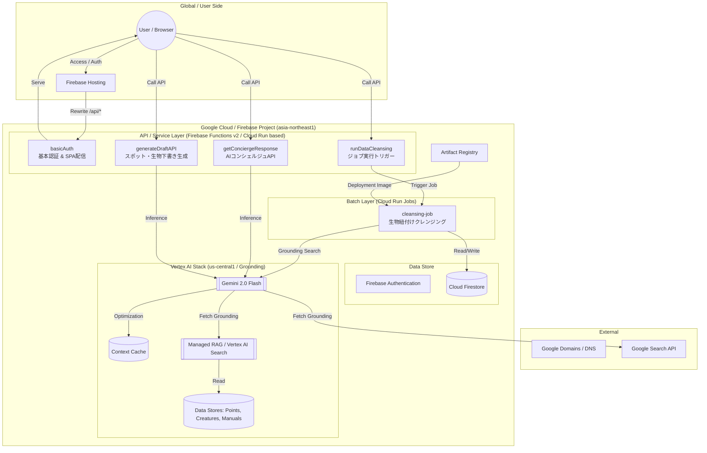

# WeDive インフラ構成仕様書

本ドキュメントは、WeDive アプリケーションのシステムアーキテクチャ、クラウドサービス、および計算リソースの連携について説明します。

---

## 1. システム構成・関係図 (Infrastructure Diagram)

WeDive は、Firebase Hosting をエントリポイントとし、Firebase Functions (v2) および Cloud Run Jobs を組み合わせたサーバーレス構成を採用しています。

---

## 2. サービス・コンポーネント一覧

### 2.1 API サービス (Firebase Functions v2)
ユーザーのブラウザ（フロントエンド）から、Firebase Hosting のリライト経由で呼び出される関数群です。これらは内部的に Cloud Run 上でマイクロサービスとして稼働しています。

| 関数名 / エンドポイント | 役割 | 連携先 |
| :--- | :--- | :--- |
| `basicAuth` | ステージング環境等の基本認証、および SPA の配布 | Firebase Hosting |
| `getConciergeResponse` | 自然言語によるスポット・生物の質問回答 | Vertex AI Search (Concierge DS) |
| `generateSpotDraft` | ダイビングスポット情報の AI 自動生成（要グラウンディング） | Vertex AI Search (Draft DS) / Google Search |
| `generateCreatureDraft` | 海洋生物情報の AI 自動生成 | Vertex AI Search (Draft DS) / Google Search |
| `runDataCleansing` | データクレンジングバッチの起動命令 | Cloud Run Jobs |
| `onPointUpdateTranslate` | 指定ドキュメント更新時の自動多言語翻訳（トリガー） | Firestore / Vertex AI |

### 2.2 バッチ処理 (Cloud Run Jobs)
API タイムアウト（60秒）を超える重い処理や、定期的な一括処理を担当します。

| ジョブ名 | 役割 | 実行タイミング |
| :--- | :--- | :--- |
| `cleansing-job` | 全ポイント・生物の紐付け整合性チェック、AI による推論と検証 | 管理画面からの手動 / スケジュール |

---

## 3. 計算リソースとロケーション

### 3.1 Vertex AI (AI 処理: `us-central1`)
- **Gemini 2.0 Flash / 1.5 Flash**: 最新の生成 AI モデルを使用。
- **Context Caching**: 数千種類の生物情報をキャッシュし、API コストとレスポンス時間を最適化。
- **Google Search Grounding**: AI の回答に実在する検索結果を統合。

### 3.2 Cloud Run インフラ (`asia-northeast1`)
- **計算拠点**: 日本のユーザーに合わせ、すべての演算リソースを東京リージョンに集約。
- **Artifact Registry**: `wedive-repo` にビルド済みのコンテナイメージを格納。

---

## 4. デプロイメント・パイプライン

GitHub Actions を通じて、以下の 3 段階でデプロイが実行されます。

1.  **Frontend Build**: Vite によるビルドと Firebase Hosting へのデプロイ。
2.  **Functions Deploy**: TypeScript コンパイルと Firebase Functions (v2) へのデプロイ。
3.  **Batch Build & Update**: Docker イメージのビルド、Push、および Cloud Run Jobs の定義更新。

---

## 5. インフラ定数 (Infrastructure Constants)

| 項目 | 値 |
| :--- | :--- |
| プロジェクト ID (本番) | `we-dive` |
| Firestore リージョン | `asia-northeast1` |
| AI プロセッサ ロケーション | `us-central1` |
| Artifact Registry Repo | `wedive-repo` |

### 6. 環境変数 (Environment Variables)

| 環境変数名 | 説明 | 使用目的 |
| :--- | :--- | :--- |
| `GCLOUD_PROJECT` | Google Cloud プロジェクト ID | Firestore、Vertex AI、Cloud Run 等のリソース特定。**必須。** |
| `LOCATION` / `GCP_REGION` | リソースの稼働リージョン | Cloud Run Job、Firebase Functions の実行場所指定。 |
| `AI_LOCATION` | Vertex AI (Gen AI) の実行リージョン | Gemini API や Context Cache のパフォーマンス最適化用。 |
| `LOG_LEVEL` | ログ出力詳細度 | DEBUG, INFO, WARN, ERROR のいずれか。システムのデバッグに使用。 |
| `BASIC_AUTH_USER` | Basic 認証ユーザー名 | ステージング・本番環境へのアクセス制限（未設定時は解除）。 |
| `BASIC_AUTH_PASS` | Basic 認証パスワード | 同上。 |
| `CLEANSING_JOB_NAME` | Cloud Run Jobs 名 | AI クレンジングを実行するジョブの名称指定。 |
| `USE_VERTEX_AI_SEARCH` | Managed RAG 有効化フラグ | `true` で Vertex AI Search を使用。 |
| `VERTEX_AI_CONCIERGE_DATA_STORE_IDS` | コンシェルジュ用データストア ID | カンマ区切りで複数指定可能。 |
| `VERTEX_AI_DRAFT_DATA_STORE_IDS` | ドラフト生成用データストア ID | カンマ区切りで複数指定可能。 |
| `VITE_FIREBASE_API_KEY` | Firebase API キー | フロントエンドからの Firebase 接続認証。 |
| `VITE_GOOGLE_MAPS_API_KEY` | Google Maps API キー | 地図の表示、座標選択、ジオコーディングに使用。 |
| `VITE_FIREBASE_PROJECT_ID` | フロントエンド用プロジェクト ID | フロントエンドが接続する Firebase プロジェクトの指定。 |
